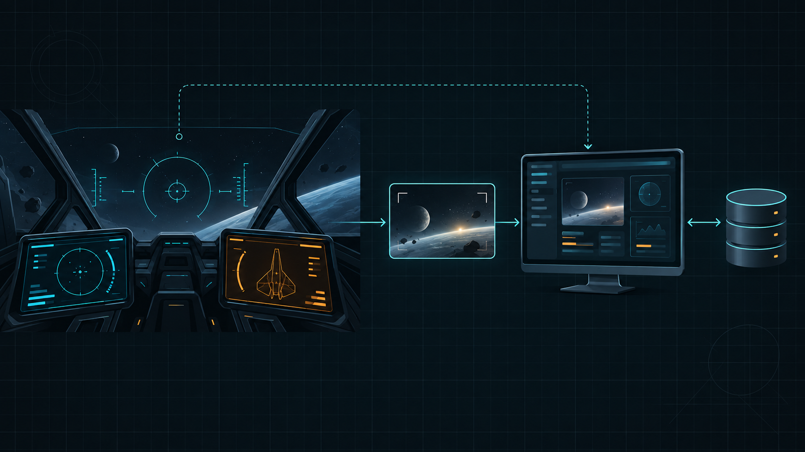

# Quantum Wake

**A private Star Citizen logbook for Windows** — by nekron

[](https://github.com/peans99/QuantumWake/actions/workflows/ci.yml)


Quantum Wake turns `Game.log` into a private local logbook for Star Citizen. It
joins sessions, ships, travel, contracts, crew, inventory sightings and
transactions with reference data from your own game install.

One local pipeline feeds the screens you use in different moments: the dashboard
for planning and history, the in-game overlay for a quick answer, and an
optional paired Cougar MFD HUD for the cockpit. Saved screenshots and copied
`/showlocation` coordinates can add facts the logs do not carry, but only after
you ask Quantum Wake to read them.


*Logs, saved screenshots and game data stay on your PC. The same local service
feeds the dashboard, overlay and cockpit displays; the MFDs receive concise
answers rather than screenshots or raw OCR output.*

The app runs on your PC and keeps its database there. Network features are
optional. Most of Quantum Wake is read-only; item labels and StarStrings are the
two features that can replace the game's English text file, and both require an
explicit install click.

> **Pre-1.0:** pages and stored formats may still change. The database can be
> rebuilt from your logs after an update.

## Install

No installer, no separate .NET runtime, no account. One file.

### 1. Download it

**[Download `QuantumWake.exe`](https://github.com/peans99/QuantumWake/releases/latest)**
from the latest release. The `.zip` beside it holds the same executable plus the
command-line parser, the README and the licence, and is only worth taking if you
want those.

### 2. Get past the unknown-publisher warning

The executable is not code-signed, so Windows will not vouch for it. If you
downloaded it from the release page above, choose **More info → Run anyway**.

SmartScreen stops warning once enough people have run a given build, so a fresh
release warns and a fortnight-old one usually does not. That is a measure of the
release's age and not of its safety.

### 3. Put it somewhere it can stay

Anywhere you can write to — `C:\Tools`, your user folder, a games drive. Two
things to avoid:

- **Not `Program Files`.** The app updates itself in place and cannot write
  there without a prompt every time.
- **Not the Downloads folder**, if you are the sort of person who empties it.

The app updates itself, so where you put it is where it stays.

### 4. Run it

It starts in the notification area rather than opening a window. Right-click the
tray icon to open the dashboard or overlay, check for updates, or quit. The
dashboard is also at <http://127.0.0.1:31337> in any browser on the same PC.

There is nothing to configure. Quantum Wake finds LIVE, PTU and EPTU installs on
fixed drives by itself. If yours is somewhere unusual, `QuantumWake.exe --path
"D:\...\StarCitizen\LIVE"` points it straight at one.

### 5. Wait for the first read

The first start reads every log the game has kept — around 180 files and 400 MB
on an install that has been played for a while. It takes a few seconds to a
couple of minutes depending on the drive, and the page says what it is doing
while it works.

Everything after that is incremental: only the current `Game.log` is watched,
and it is read as the game writes it.

**Where things end up:**

| | |
|---|---|
| Your data | `%LOCALAPPDATA%\Quantumwake` |
| Read from | `<StarCitizen>\LIVE\Game.log` and `\logbackups\` |
| Dashboard | <http://127.0.0.1:31337> |

Nothing is written inside the game folder unless you install item labels or
StarStrings, which are the two features that replace the game's English text
file and both need an explicit click.

### 6. Turn the overlay on, if you want one

It starts disabled. Star Citizen must use **Borderless Windowed** for it to
appear at all — in fullscreen it is behind the game and you will not see it.

Click the overlay's pin button to let mouse clicks pass through to the game;
the tray icon or `Ctrl+Alt+O` brings it back. `Ctrl+Alt+←/→` changes page and
`Ctrl+Alt+F` goes fullscreen.

### Updating

The tray icon checks for updates when you ask it to, downloads the new build and
restarts into it. Nothing is checked until you allow it, and the choice is
remembered.

**Some updates re-read your whole history on the first start afterwards**, which
makes that one start slow. This is deliberate and is how a fix reaches sessions
that were summarised before it existed — 0.9.57 and 0.9.58 both did it, to give
past contracts their real completion times. The release notes say so when it
applies.

### Uninstalling

Delete `QuantumWake.exe` and delete `%LOCALAPPDATA%\Quantumwake`. That is all of
it: nothing is written to the registry, no service is installed, and the game
folder is untouched unless you installed item labels — in which case remove
those from the app first, or the game keeps the marked text file.

## What it helps with


*Visited places are solid and sized by visit count. Empty nodes are known but
unvisited. The map uses logged locations and quantum travel; it is not a live
position tracker.*

| Surface or view | What it answers |
|---|---|
| **Now and overlay** | Where am I, what am I flying, and what changed during this session? |
| **Map, places and points** | Where have I been, where is a place or commodity, and how far is a point from the last copied location? |
| **Flight plan and checklist** | What is my next stop, what has to happen there, and what can be checked off? |
| **Sessions, contracts and crew** | How long did I play, which contracts changed, and who did the log name? |
| **Fleet, loadout and stash** | Which ships and gear have appeared, what fits, and where something was last seen? |
| **Ledger, cargo and market** | Which transactions were confirmed, what did a counter record, and where is a commodity traded? |
| **Mining, crafting and items** | What the installed game data says about deposits, recipes, parts and shops. |
| **Screen readings** | What a saved screenshot or copied `/showlocation` says, checked against the logbook where possible. |
| **Cockpit HUD** | Optional paired Cougar MFD pages for navigation, tasks, cargo, contracts, money and the live feed. |
| **Item labels** | Optional in-game marks for component size, grade, armour class and hard-to-buy gear. |

Tables can be sorted by their column headings. Dashboard cards can be hidden,
collapsed and rearranged.

<table>
  <tr>
    <td width="50%"><a href="docs/images/fleet.png"></a><br><sub><b>Fleet</b> — ships seen on the account and how often they flew</sub></td>
    <td width="50%"><a href="docs/images/ledger.png"></a><br><sub><b>Ledger</b> — confirmed transactions with their source</sub></td>
  </tr>
  <tr>
    <td width="50%"><a href="docs/images/sessions.png"></a><br><sub><b>Sessions</b> — game time separated from menu time</sub></td>
    <td width="50%"><a href="docs/images/stash.png"></a><br><sub><b>Stash</b> — gear and its last recorded location</sub></td>
  </tr>
  <tr>
    <td width="50%"><a href="docs/images/upgrades.png"></a><br><sub><b>Upgrades</b> — compatible parts, prices and shops</sub></td>
    <td width="50%"><a href="docs/images/market.png"></a><br><sub><b>Market</b> — commodities and the counters that trade them</sub></td>
  </tr>
</table>



*The cockpit HUD stays focused on a pilot's next decision. Saved screenshots can
add facts that `Game.log` never writes, such as a kiosk balance or a ship's
fittings; they are read locally and kept as dated readings, not treated as live
telemetry.*

## Data sources

Quantum Wake reads three kinds of data:

1. **Your logs.** `Game.log` and its backups provide sessions, travel, ships,
   contracts, party activity, inventory sightings and confirmed transactions.
2. **Your game install.** `Data.p4k` provides names, items, commodities,
   crafting recipes, mining deposits, place descriptions and facilities. The
   first read after a game patch takes about half a minute and is then cached.
3. **Screenshots and copied locations, when you ask for them.** The optional
   screen reader reads the newest saved Star Citizen screenshot or a
   `/showlocation` copied by the game. It never captures the display, reads
   game memory or sends the image away.
4. **Optional community services.** UEX adds current prices and shop listings.
   StarCitizenWiki's scunpacked dataset adds ship specifications and wider map
   and mining coverage. Both integrations are off until enabled in Settings.

No game data is committed to this repository.

## Known limits

- **No live position.** The logs record arrivals, inventory locations, spawns
  and quantum routes, not player coordinates. Map locations are inferred and
  carry a confidence level.
- **No complete killboard.** Star Citizen 4.9 and 4.10 do not emit the old actor
  death and vehicle-destruction events. The parser still understands the
  archived format, but current counters remain empty.
- **No automatic mining history.** The game logs no extraction, scan or refinery
  job. Ore sold without a recorded purchase is shown as likely mined, and a
  separate manual mining log is available.
- **No complete wallet history.** A readable screenshot can establish a cash
  balance, and logged movements can carry it forward as an estimate. The logs
  still do not state contract or bounty payouts, so trading remains a floor on
  total income.
- **Crew is a floor, not a roster.** A player who was already connected may
  produce no join event.

Account wipes can be recorded in Settings. Older sessions stay available, but
totals exclude data from the reset categories you select.

## Privacy and safety

- Logs and `Data.p4k` are read locally.
- Item labels and StarStrings write only after you request an install. Each
  keeps a manifest and backup so it can restore what it replaced.
- There is no process injection, memory reading, graphics hooking or telemetry.
- Version checks, UEX and the community dataset are opt-in.
- LAN mode is off by default.

**Settings → Report a problem** creates a small diagnostic file with parser
counts, game builds and integration state. It does not include logs, account
identifiers, handles, folder names or API keys. You can read the file before
attaching it to an issue.

## Requirements

- Windows 10 or 11
- WebView2 for the overlay; it is included with Windows 11 and available from
  [Microsoft](https://developer.microsoft.com/microsoft-edge/webview2/) for
  Windows 10
- The [.NET 10 SDK](https://dotnet.microsoft.com/download) only when building
  from source

## Run from source

```powershell
.\start.ps1                     # tray icon, dashboard and overlay
.\start.ps1 -NoOverlay          # server only
.\start.ps1 -Lan                # allow another device on the network
.\start.ps1 -Rescan             # rebuild the log cache
.\start.ps1 -Path "D:\...\StarCitizen\LIVE"
```

The command-line parser is useful for verification and automation:

```powershell
dotnet run --project src\Quantumwake.Cli -c Release
dotnet run --project src\Quantumwake.Cli -c Release -- --events
dotnet run --project src\Quantumwake.Cli -c Release -- --events --kind commodity.sell,commodity.buy
```

`--events` writes newline-delimited JSON to stdout. Progress and the summary go
to stderr, so the output can be piped directly into another tool.

## Try it without playing

`Quantumwake.LogSim` creates a fake install with logs in the real format:

```powershell
dotnet run --project src\Quantumwake.LogSim -c Release -- --backups 12 --combat
.\start.ps1 -Path "$env:TEMP\QuantumwakeFakeInstall\LIVE"
```

`--live` appends events while the app is open. `--combat` includes archived
kill and vehicle-destruction events so those views can be exercised. Simulated
installs have their own cache and do not mix with real account data. See
[docs/log-simulator.md](docs/log-simulator.md) for all options.

## Architecture

### One local pipeline, three ways to use it

`QuantumWake.exe` hosts the local ASP.NET Core server, the dashboard assets and
the Windows overlay. There is one source of truth: the parser and reading stores
write local data, then the server provides it through REST and the live event
stream. The dashboard is the full logbook; the overlay and MFD HUD are focused
views over the same state.

```text
  Star Citizen install                         Quantum Wake on this PC
  ────────────────────                         ───────────────────────────────
  Game.log + backups ──> Core parser ──────┐
  Data.p4k ─────────────> game-data reader ├──> Data stores + local SQLite
  saved screenshot ──────> optional OCR ───┤              │
  copied /showlocation ──> local reader ───┘              ▼
                                              ASP.NET Core API + live stream
                                                           │
                              ┌────────────────────────────┼──────────────────────────┐
                              ▼                            ▼                          ▼
                       browser dashboard            WPF overlay              paired Cougar MFDs
                       planning and history         in-game glance            cockpit decisions
```

Screen reading is intentionally a file-and-text feature, not live screen
capture. When enabled, it reads a saved screenshot locally and records a dated
result. The dashboard can show the complete reading and its checks; the overlay
and MFDs get only the short answer they need, such as a recent screen summary
or a kiosk balance carried forward by logged movement.

The release remains one executable. The dashboard and MFD pages are embedded
with it, the database stays under `%LOCALAPPDATA%\Quantumwake`, and network
services remain opt-in.

| Project | Purpose |
|---|---|
| `Quantumwake.Core` | Log tailing, parsing, game-data readers and session state |
| `Quantumwake.Data` | SQLite cache, aggregates and local settings |
| `Quantumwake.Server` | REST API, event stream and static dashboard |
| `Quantumwake.Overlay` | Windows tray application and transparent overlay |
| `Quantumwake.Cli` | Parser verification and JSON event export |
| `Quantumwake.LogSim` | Fake-install generator |

Only the overlay is Windows-specific. The other projects target `net10.0`.

## Tests

```powershell
dotnet test Quantumwake.slnx -c Release
```

The repository currently has 1,815 tests. `Quantumwake.Tests` covers parsing,
session state, stores and game-data readers. `Quantumwake.WebTests` executes the
dashboard and MFD JavaScript against a stub DOM.

Parser fixtures are copied from real log lines. The CLI is then run against the
local backup corpus before a release to catch format changes that fixtures do
not contain.

## Documentation

- [Game-data reader](docs/datacore.md)
- [Log-format reference](docs/log-format-reference.md)
- [Missing combat-event findings](docs/findings.md)
- [Architecture decisions](docs/architecture.md)
- [Cockpit HUD / Cougar MFD mode](docs/mfd-mode.md)
- [Screenshot and clipboard reading](docs/screen-insight.md)
- [Problem-report contents](docs/bug-reports.md)
- [Release process](docs/releasing.md)
- [Credits and external sources](docs/credits.md)

## Licence and credits

The code is licensed under [Apache 2.0](LICENSE). The name and logo are not
licensed. Manufacturer artwork comes from the official Star Citizen Fankit and
has separate terms; see [NOTICE](NOTICE) before redistributing it.

Quantum Wake builds on community knowledge and tools from StarLogs, all-slain,
SCStats, SCPlay, scdatatools, unp4k and others. StarStrings is made by MrKraken.
The complete attribution list is in [docs/credits.md](docs/credits.md).

Star Citizen®, Roberts Space Industries® and Cloud Imperium® are registered
trademarks of Cloud Imperium Rights LLC. Quantum Wake is an unofficial fan
project and is not affiliated with or endorsed by Cloud Imperium Games.

## Release notes

### 0.11.11

- **Hangar paint pictures always have a visible ship behind them.** A
  maker-tinted silhouette now sits behind each game's paint render, so a
  transparent or incomplete render cannot leave its Hangar card blank.

- **The ship catalogue shows every shop and rental desk on hover.** The buy
  price and "Cheapest at" cells list everywhere UEX has seen the ship sold,
  cheapest first, and the Rent cell lists every desk that rents it - with a
  "+N" beside the cell when there is more than one. The cheapest is still
  the number; the nearest is usually the one you want. The full shop list
  fills in at the next UEX refresh; until then a ship shows the one shop it
  already knew.

- **Ships show their default livery when the game has a picture of it.** The
  paint folder in the game files holds the stock finish of 26 hulls that no
  paint item points at - the Clipper, Hermes and Paladin among them. Those
  now come first in the Paint list as "Default livery", and a ship you have
  not picked a paint for wears that. For a hull without one - most of them,
  the Corsair included - there is no picture of the stock finish anywhere in
  the files; the first paint still stands in, and the card says why.

- **Wikelo has a current goal.** Set one of his trades as your current goal to
  keep it above the emporium while you browse other groups. The pin stays in
  this browser, like the roster tick and paint choices.

- **Fleet is easier to work from.** Favourite ships, filter to favourites,
  ships, ground vehicles, or flights from the last seven days, and see those
  states on each card. Click a ship picture for its flights, time aboard, last
  flown, and its size from the installed vehicle table. Choose whether unpicked
  ships show the game's first paint or the maker-tinted silhouette.

- **Compare two ships in the Hangar.** Select two Fleet cards, then open their
  shared to-scale Hangar view. The comparison is temporary and does not change
  your roster.

- **The Hangar's big ships share a shelf again.** In the to-scale view, the
  gap between ships is now included when the deck is sized, so two large ships
  fit side by side at the normal zoom instead of the second one wrapping below.

- **Ships wear a paint before you pick one.** A ship you have not chosen a
  paint for shows the first paint the game pictures for its hull, on Fleet
  and in the Hangar gallery, rather than the tinted silhouette. It is labelled
  as a stand-in - which paint yours wears is not in the logs - and the Paint
  list opens on it and says so. Choosing the silhouette is a choice too, and
  it is kept.

- **The Hangar keeps to your roster and shelves ships and vehicles apart.** A
  ship you unticked on Fleet is not in the Hangar either, and the count says
  how many it left out. In the to-scale view, ships sit on one shelf and
  ground vehicles on another - the game's own word for what moves each - at
  the same scale, so the Ursa beside the Starlancer is the real difference.
  A paint picked on the Hangar now shows at once rather than after a reload,
  and a render that fails to load once keeps your pick.

- **The Hangar opens as a gallery.** One card a ship - the game's render in
  the paint you chose on Fleet, or the tinted silhouette - with its size,
  sorties and hours under it, and a Paint button on each. **To scale** is a
  switch away for the plan view drawn at one scale; the gallery does not
  pretend to be, which is why the scale bar leaves with it.

- **Ships in colour.** The game's silhouettes are white, so on Fleet and Hangar
  they are now tinted in their maker's colour - a hint at whose ship, said to
  be one, not the finish. For the real thing, each Fleet card has a **Paint…**
  button listing the liveries the game pictures for that hull (the Corsair has
  ten, the Cutter twenty-six); pick yours and the card shows the game's own
  render of it. The app never picks - which paint a ship wears is not in the
  logs - and the choice stays in this browser, like the roster tick.

- **Your fleet, drawn to scale.** Flight → Hangar draws every ship your logs
  say you have flown at one scale, from your installed game files: the
  silhouette is the game's own vehicle icon and the size is the bounding box
  the game gives the ship, so a Pisces beside a Corsair is the real difference.
  Sort by length, sorties or last flown; zoom in when the small ones get small.
  A ship the install has no icon for is drawn as a box at its size; one it
  cannot size is named below rather than drawn as a guess. The same silhouette
  sits on each card on the Fleet page.

- **Wikelo's emporium, from your game files.** Jobs → Wikelo lists every trade
  the Banu collector offers - what he builds, what he wants for it, the rep it
  pays and which rank it needs - read from the installed patch rather than a
  guide, so the numbers are this build's (the Polaris is 50 Favors, whatever a
  page from 4.9 says). Each requirement is ticked against your stash sightings
  by the same rule the Jobs page uses: seen somewhere, never a count. **Track
  as a goal** makes a shopping list of everything a trade wants; pin it and it
  is on Now and the MFD like any other list. Retired trades still in the file
  are counted and hidden; your standing with him is not in the logs, so a rank
  gate is stated, not judged.

### 0.10.47

- **Help answers the questions people actually arrive with.** Twenty-six
  answers in five groups instead of eleven in three: the orange wipe banner,
  showing the dashboard on a tablet, which keys do anything, where the data
  lives; the trading rate, the ~ on the Ledger, how the wake-up card infers
  your regen; how to mark a point, why it says "believed to be", how far away
  it is, which screens the reader can and cannot read, what to do with a wrong
  reading; what a shared file carries, what happens to one you are sent, and
  what a backup holds and leaves out. Each answer links to the page it is
  about. A filter box narrows the page to the questions that mention a word
  - in the answer as well as the question - and **Expand all** opens them.

- **Share your points of interest the way you share prices.** Settings → Share
  what you have has a fourth box: your points, with the name, category and note
  you gave each - and which system your logs believed, or you said. A friend
  opening the file sees them on their Points page under **Shared by others**,
  with whose they are, whose word the system is, and the distance from wherever
  they last copied a location by the same rule as their own points. Nothing is
  merged: removing the file takes them away and leaves their own untouched.
  **Keep as mine** copies one across as their own point, with a note saying who
  shared it. Coordinates that are not numbers, dates in the future and notes
  past the cap are dropped or cut on the way in and counted, as with every
  other shared class.

- **Help is where the questions are.** About now opens a dedicated Help & FAQ
  page with setup, privacy and reporting guidance updated for the paired Cougar
  MFD HUD, saved-screen reading and cash estimates.

- **A README that reflects the whole current app.** The opening now explains
  the shared local pipeline behind the dashboard, overlay, paired MFD HUD and
  optional screen readings. The feature list is grouped by the questions each
  surface answers, and a new architecture image sits at the top of the page.

- **A clearer map of the new cockpit and screen tools.** The README and
  technical notes now explain what the paired Cougar MFD HUD reads, how saved
  screenshots and copied locations stay local, and how their small summaries
  reach the dashboard and cockpit displays.

- **Cash on hand where you fly.** The balance the Ledger shows - from the last
  screenshot that printed it, carried forward by the movements logged since -
  now leads the Cougar MFD's Money page and sits on the Now page's trading
  card, which the overlay shows in game. Carried forward it is called an
  estimate and says what it rests on; before any screenshot has shown a
  balance there is no line, not a zero.

- **How far are the things you marked?** Copy a `/showlocation` in the game and
  the reading on the Log now lists the nearest of your points with the
  distance - *Ruin mining shelf · 12.4 km* - and the Points page measures every
  card from wherever you last copied, saying when and where that was. A point
  in another system is named as not measurable rather than given a number:
  the same coordinates mean different places in Stanton and Pyro. Nothing
  decides how near counts as "there" - that differs between a cave mouth and a
  belt, and you can judge a distance better than the app can guess one.

- **A point says what its "believed to be" rests on, and you can set the
  system yourself.** A copied `/showlocation` names no system, so the app
  places it from the logs - and now says on what: *from a location signal 4
  min earlier*, or *from a quantum jump 40 min earlier - where the ship was
  going, not that it arrived*. Each card has a System selector; a copy the logs
  could not place asks for it rather than showing nothing, and a system you set
  is shown as yours from then on, with what the logs had said beside it.

- **Points of interest are in the backup now.** Every pin - its name, category
  and note - goes into the backup file and comes back through the same restore
  review as your jobs and kits: a point you removed on purpose is not handed
  back unasked, a newer note here is kept over an older one in the file, and
  the sentence on the Backup page says how many points a backup would carry.
  Backups taken before 0.10.38 hold no points; take a fresh one.

- **On the Points page, saving one card no longer discards what you were typing
  on another.** Only the saved card is redrawn.

- **Points of interest have a page of their own, with room for why.** Under
  Flight, next to Places: every `/showlocation` you pinned, as a card with its
  name, category, exact coordinates, when it was copied and which session that
  fell in - and a note. Write down why you were there, what is there and what
  to bring next time; nothing in the logs will ever say. Search reads the notes
  as well as the names, categories become filters once there is more than one,
  and a card with something typed and not yet saved shows an amber bar until
  it is. The Log's pinned-points aside shows the note and links to the page.

- **The Ledger now shows your cash on hand.** Game.log never states a balance,
  so the figure comes from the last screenshot that showed one, dated and named
  on the card, and the movements logged since carry it forward. The carried
  figure is labelled an estimate, with the count and net of the lines it rests
  on, because money that moved without a line in the log is not in it - the
  next screenshot says by how much. Until a screenshot has shown a balance the
  card says so rather than showing a zero.

- **A commodity kiosk that prints the balance in full is now the wallet.** The
  first kiosk photographed abbreviated it - `1,583M` - and no figure was ever
  taken from a kiosk. Your own kiosk prints every digit, and that reading is the
  only place any screen has shown the balance in a face the reader can read. A
  figure with a suffix is still kept as printed and never becomes a number. The
  reader also no longer mistakes the close button's `x` beside "Current
  balance" for the balance itself.

- **A reading you do not trust can be invalidated from the Log.** It stays in
  the list, struck through and saying so, but the wallet, the fleet, the
  fittings and the Now card stop using it; it can be believed again with one
  click. Each reading also has **Read again**, which puts the same screenshot
  through the reader as it is now and replaces the old reading - so a screen
  the app learned to read after you photographed it is read at last.

- **The Cougar frames now work as a cockpit pair.** The left frame opens as
  Navigation and the right as Mission. The Mission card keeps the active
  contract, destination, objective progress and a matching Contracts-screen
  reward together; a captured reward is shown only when its selected contract
  matches the live one. Its bezel becomes **Map**, **Done**, **Contract**,
  **List** and **Home**, making the next drill-down visible on the hardware.

- **The Cougar MFD map is now a radar instrument.** Its real body-centre
  geometry has range rings, a sweep and a lock reticle for the selected body.
  The sweep turns about the star and trails behind itself, rather than drifting
  outside the rings as a short bar attached to nothing.
  The five upper bezel buttons become **Nav**, **Previous**, **Next**, **POI**
  and **Here**, so the frame names what it can do on that screen. POI opens the
  named points kept in the MFD Log; positions are never invented from a name.

- **The MFD menu scrolls instead of cutting its labels off.** On a small frame,
  or with the text turned up, five tiles did not fit and each was squeezed into
  a box shorter than the word standing in it - so "Operations" was clipped and
  looked like a shorter word rather than a hidden one. The tiles keep their
  height and the menu scrolls to the ones below.

- **The HUD now puts one useful thing in front of you.** Its Focus strip opens
  the next stop, active contract, current location, or a screen that needs
  attention. The Log keeps repeated clipboard-watch readings as one location
  with a seen count, while a deliberate read remains a new entry.

- **Points and unfamiliar screens are easier to work with.** A saved location
  can have your own name and category, including on the MFD. Screenshots the
  app cannot yet interpret now collect in a review queue with the capture and
  extracted text together, ready to turn into the next reader.

- **A Log tab keeps what you showed the app in one place.** Screenshots and
  copied `/showlocation` readings now have a direct dashboard tab instead of
  living under Overlay settings, and the Cougar MFD has the same compact Log
  screen under Pilot. A copied location can be pinned as a point of interest;
  pins keep the exact coordinates even when routine readings are cleared.

- **The Log is clearer at a glance.** Reading controls, recent activity and
  pinned points are arranged as visual cards, with a small action on each
  copied coordinate rather than a separate configuration flow.

- **The ledger pages, instead of stopping after the first few.** It showed the
  newest handful, told you there were more and gave you no way to reach them.
  **UP** and **DOWN** now move a page at a time and the title says where you
  are — *Ledger · 4-6 of 95* — and it reads back thirty days rather than three,
  because paging through three days is not worth a button. Item names lose
  their underscores, so an entry wraps instead of taking a whole line as one
  unbreakable word.


- **The system map puts where you are at the top.** Location and next stop were
  under the plot, which on a small opening meant scrolling a map to find out
  where you were — the one thing you opened it for. They are above it now, and
  the plot is sized to leave room for them rather than to fill the frame.

- **The map caption says what it means.** It read "straight line, not a fix",
  and a fix is the word for a position — so it looked like a warning about
  where it had put you, which is not what was in doubt. It now says **direct
  line, not the route flown**: the distance is body centre to body centre, and
  the game never writes down the route it actually plots.


- **Brightness is four levels now, and a button can reach every one of them.**
  It used to nudge five percent at a time, which is fine for a mouse and no use
  at all on a frame — you press until it looks right, and next flight you do it
  again. Bind **Screen brightness · 1 to 4** and one button cycles 40, 60, 80,
  100 and round again, showing the level it is on. The one-level brighter and
  dimmer commands are still there for the rocker printed BRT. If you had set
  something in between, it moves to the nearest level once.


- **Setting up the buttons now shows the frame, not a form.** Binding a key
  meant reading past twenty-eight dropdowns of thirty-six options each, none
  of which said which key on the desk it meant. Setup draws the Cougar
  instead: the twenty face buttons in their real positions around the screen,
  the rockers in a row underneath, each carrying its number and what it does
  today. **Press a button on the frame and its position lights up and is
  selected**, so binding one is press, pick, done — and the picking is a
  single grouped list rather than a thousand entries.

- **Frames can dim themselves when you leave them alone.** Off unless you
  pick a time in **Screen** — five minutes to an hour. After that the frames
  drop to a third of your brightness, and the next press of anything brings
  them straight back before it does whatever it was bound to do. They never
  blank: a panel you can still glance at beats one that has to be woken
  first.

- **Each frame opens where it is useful again.** Both were starting on the menu,
  so a two-frame cockpit showed the same list twice. A frame you have not used
  yet opens on Navigation on the left and your flight plan on the right; once
  you move it, it remembers where you left it.

- **Two presses to any screen, one to Navigation.** The menu had a middle
  level — Flight → Route → Navigation — and every one of those middle entries
  split just two screens, so it cost a press on the way to everything and
  sorted nothing. Categories now hold their screens directly, which fits the
  five top buttons with room to spare, and **Navigation** sits on Home beside
  the four categories rather than behind one of them.


- **A real drill-down menu for Cougar MFDs.** Home opens Flight, Operations,
  Resources or Pilot; each category opens its own submenu before the page. For
  example: **Flight → Route → Navigation / System map**. Top buttons follow the
  visible level, **Back** follows the whole path up, and **Home** returns to the
  cockpit root. The menu is data-driven, so later features can add another level
  without adding a navigation rule.

- **Less prose on the frame.** State, source and caveat rows now use labelled
  icons with short operational text. Loading, disconnected plans, empty logs,
  no crew, counter state and similar conditions no longer fill the display with
  dashboard instructions. The detailed explanation remains in the dashboard.

- **The readings read like an instrument.** Every line is a glyph, a short label
  and the value, all on one line, at a smaller size — instead of a label stacked
  over a value that wrapped constantly. All four Nav readings now fit a 480 px
  panel without scrolling; they used to run off the bottom.

- **The disclaimers are gone from the frame.** A qualifier nobody reads is not
  doing its job, so the claim moved into the label that *is* read — the rate is
  **TRADING RATE**, a list says **2 of 5 seen** rather than "held", a claim is
  **CLAIM, PER THE TABLES**. The two that prevent a genuinely dangerous
  misreading stay: Cargo still says *Never the hold*, Crew still says *Absence
  means nothing*. The full explanations live in the docs and on the settings
  page, where there is room to read them.

- **Here lists what a place actually has**, rather than naming every service
  with its status — five facts to say "none of them", wrapping to four lines.
  It reads *Refuel · Repair*, or *None of 5 listed here*.

- **A MAP page**, on the button between **UP** and **DOWN**: the system plan at
  full size, with where you are and where you are going underneath it.

- **One strip of chrome instead of two.** The frame said which MFD it was at the
  bottom, next to a readout of the button you had just pressed with your own
  thumb — two things costing a whole reading on a 480 px panel. Which frame it
  is and which Cougar drives it are at the top with the rest of the identity now,
  and the footer is gone.

- **Shorter words on the frame.** The qualifiers that keep each page honest were
  turning into paragraphs. They say the same thing in a phrase — *"Counter
  receipts and your plan. Never the hold."*, *"Held: seen in a stash listing, not
  counted."* — and the lists are cut to what you read at a glance rather than
  what a report would show.

- **Four more pages, from data the panel was already downloading.** **Ship**
  says what you are flying, what it is for, and what the game’s own tables say
  losing it costs. **Here** is the moment after landing: what this place can do
  for you, what on your shopping list it stocks, and what you left here last
  time. **Ledger** is what the logs actually priced, confirmed only. **Mine**
  is where the deposit tables rank a rock highest.

  Six of the nine things the panel fetches every five seconds were being thrown
  away, so three of those four pages cost no extra request at all.

- **Done no longer acts where it looks dead.** It is dimmed on every page but
  Act, and dimming was all that happened: two presses elsewhere still marked a
  task off your flight plan, with the confirmation drawn on a page you were not
  looking at. Dimming a button and refusing its press are one rule now.

- **A confirmation stays attached to the task it was armed against.** Your plan
  is re-read every few seconds, so the line under the cursor when you armed
  **DONE** could be a different job by the time you pressed again — and the
  second press took whatever was there. It now stands down and says the plan
  moved. A second press while the first is still saving is ignored rather than
  sent twice, which would have put the line back where it started.

- **Nav leads with where you are going.** The destination and its distance were
  third, under the map, off the bottom of the panel. They are the headline now,
  with your location beneath and the map shrunk to a supporting picture.

- **The confirmation on Act has a fixed strip of its own.** It used to be the
  last row of the very list it was asking about, and scrolled out of sight. It
  reads *Confirm: load · 32 SCU · Titanium?*, then says what was marked.

- **A small opening gets a layout of its own.** Below 320 px the captions switch
  to short forms rather than clipping, the map and the corner marks step aside,
  and the spacing tightens.

- **The MFD section on the Overlay page is documentation now.** It was shaped
  like settings and could change nothing: everything that configures MFD mode is
  in the tray window, because that is the only place that can see your monitors
  or read a frame. It now says how to get there, in order.

- **Optional Cougar MFD displays.** Open **MFD setup…** from the tray to place
  independent left and right displays on a shared monitor or separate monitors.
  Drag and resize the areas, preview alignment behind the frames, and save the
  placement. Six pages: where you are, the next planned task, the outstanding
  work at that stop, what you planned to load against what the commodity
  counters recorded, the contract you accepted this session, and where all of
  it came from. MFD mode starts off; the regular overlay keeps its own
  settings.

- **Quantum Wake's own mark, small, in the corner of the frame.** Bottom left,
  beside the device line — the ship maker's mark already has the top corner.

- **A calmer frame.** Brightness and text size are sliders in **MFD setup** now
  rather than four buttons on the face, and previous/next page and Home ship
  unassigned — with a button for every page, cycling was a second way to do the
  same thing and a bottom row of five navigation keys was the most confusing
  part of it. Thirteen buttons instead of twenty, and the three that are left —
  up, down and **DONE** — dim on a page where they have nothing to act on. Every
  one of those commands is still there to bind if you want it.

- **The Now page, broken across the frame.** Ten pages now, each with its own
  button: Nav, Task, Act, Cargo, Contract, Status, and four new ones — **Feed**
  (what just happened, straight off the live log), **Crew** (who the party
  channel has named, and why that is a floor rather than a roster), **Money**
  (your trading rate and how long a goal will take at it) and **List** (shopping
  lists and how much of each you are holding). Session time, deaths, your handle
  and where you would wake up folded into Status; where a price is better folded
  into Cargo. Nothing on the frame is unassigned any more.

- **A system plan on the Nav page, with the whole route on it.** Small, above
  the words: the star, the bodies at their real coordinates, the one you are at
  ringed, and a dashed leg to every planned stop in the order you will fly them
  — with the distance beside it. It marks a body and says so; the logs name the
  place you are at, never where you are on it, and the distance is a straight
  line between body centres rather than a quantum route the game never writes
  down.

- **The maker's mark of the ship you are flying**, in the top-left corner of
  every page. Nothing shows for a maker with no logo, or before a ship has been
  identified.

- **Icons above the button captions**, and a blank where a button does nothing.
  The number used to sit there, labelling a button the pilot is looking straight
  at; a blank position now reads as blank, the way a real MFD's does.

- **The alignment preview follows the editor as you drag.** It updated only
  when you let go of a rectangle, and — worse — saving switched it off, so after
  one save nothing you changed reached the frames until you saved again. The
  preview now moves under your hand and keeps running after a save; **Stop
  preview** or closing setup puts the saved placement back.

- **MFD mode looks like the rest of Quantum Wake.** The placement editor had
  grown a palette and typeface of its own; it now uses the dashboard's own
  stylesheet, so it cannot drift again. The instrument moved off its phosphor
  green onto the same cyan HUD palette as everything else. And the placement
  editor opened in a browser draws one invented monitor that used to look
  exactly like a detected one — it now says it is an example, and that your own
  monitors are only found when you open setup from the tray.

- **The monitor behind the frames goes black.** A Cougar frame covers part of a
  monitor, and the rest of it keeps glowing around the bezel — wallpaper, the
  taskbar, whatever was there — which in a dark cockpit washes out the
  instrument inside the opening. Quantum Wake now fills those monitors with
  black around the openings. Turn it off with **Black out the rest of those
  monitors** if a panel is sitting in the corner of a screen you are still
  using. The monitor you have setup open on is left alone until you close it.

- **Tick work off from the frame.** The Act page lists what is still to be done
  at your next stop and marks one done with the **DONE** button — pressed once
  to arm it and again to confirm, so a glove on the wrong button costs nothing.
  It writes to your own flight plan and tells the game nothing.

- **Every button can be reassigned, rockers included.** Setup now carries the
  full button map, shared by both frames. The four rocker switches report as
  buttons 21–28 and ship unassigned, because which rocker is which number is
  not something a datasheet answers: press one, watch the tester name it, and
  bind it. **Restore defaults** puts the shipped profile back.

- **Cargo, honestly.** The game logs no cargo hold, so the Cargo page shows what
  your plan says to load and what the commodity counters actually recorded this
  session, each labelled as what it is. It never claims to know what is aboard.

- **Screenshots of the Contracts app are checked properly now.** Reading a
  mobiGlas Contracts screenshot compared it against a list that was always
  empty, so a photograph of five accepted contracts reported "the tab says 5,
  the logs say 0" and marked every one of them as unseen. It now compares
  against the contracts the logs actually carry.

- **Readings now reach the overlay, and tell you when something is off.**
  The last screenshot read appears on the Now card in the dashboard and in
  the in-game widget, without your having to open the settings first. Before
  this it only updated after a visit to the Overlay page, so the widget never
  showed a reading at all.

  **A toast when the screen and your logs disagree**, and only then. Taking
  six shots of a loadout should not put six notifications on your screen, so
  a reading that agrees updates the card quietly and says nothing.

- **A log of everything you have shown it**, on the Overlay page. Every
  screenshot read and every location pasted, newest first, with what your
  logs said at that moment beside it. A pasted location is kept with the
  place your logs had you at the time, because the reading itself names
  nowhere and three numbers are unreadable a week later. It stays on this
  machine, and there is a button to clear it.

- **Off means off.** Switching the screen panel off now clears the reading
  from the Now card and the widget as well, rather than leaving the last one
  you took sitting there.

- **Commodity kiosks read.** Point a screenshot at a shop terminal and the
  buy side comes back as a list: what it stocks, how much of it, and what it
  is asking. Your logs record what you paid and never what was asked, so
  every one of those prices is new.

  **The unit stays welded to the price.** One kiosk priced Hephaestanite per
  unit and Corundum per SCU on the same screen. Those are not the same
  quantity, nothing here converts one into the other, and each price is
  shown with the word the kiosk printed beside it.

  **What it will not do.** A kiosk abbreviates your balance — ¤1,583M — and
  that figure is shown as printed and never taken as a number, because a
  rounded balance used as a starting point would put every later reading out
  by whatever the rounding hid. A price that did not read is missing rather
  than borrowed from the row above. The sell side is kept whole but not read.

- **The inventory screen carries no names.** Photographed with a location’s
  stash open: the items are icons, and the only text on a tile is a stack
  count. So a stash can be confirmed one hovered item at a time, which
  already works, and not a screen at a time.

- **Four more screens read: the Contracts app, the Rep app, the Fleet
  Manager and its loadout estimate.** The Contracts tab’s own count and
  every card on it are checked against the contracts your logs have open,
  by number and by name. The Fleet Manager says where each of your ships is
  stored, which nothing in the logs has ever said, and a ship it lists that
  you have never flown is filed as new rather than as a mistake. The Rep app
  gives an organisation and your standing with it; the rank is drawn as a
  highlight and does not read, and the reading says so.

  **The wallet read.** On three of the twenty-two frames from the second
  night the balance came back, and two readings a minute apart reconciled
  against the ledger. On the other nineteen it did not, from the same bar,
  so a reading is a gift rather than a promise — and a screenshot taken
  while the game is logging is checked against where you actually were.

- **Every screenshot you take can be read as it lands, and checked against
  your logs.** Tick **Read each screenshot as it lands** on the Overlay page
  and each new one is sorted into the screen it is — an item’s tooltip, the
  Vehicle Loadout Manager, the mobiGlas map — and what it says is set beside
  what the app had worked out from your logs at that moment. Where the two
  disagree, it says so. Nothing already in the folder is read, and the setting
  names the folder it follows.

  **What your ship is actually carrying.** The logs record nothing about what
  is bolted to a ship, so until now the Fleet page showed the factory fit,
  which is the same for everyone. A loadout screenshot names the parts in each
  port — 39 of 47 ports across the six frames in this install — and the Fleet
  page shows them, dated, with the parts the factory did not fit marked as
  such. On this install that is Genoa power plants, a Parapet shield and Chaos
  missiles the Corsair did not ship with.

  **Where you were, from the map.** The map footer names the system and the
  place, and the reading is checked against where the logs had put you at the
  second the shot was taken. The same screen says whether you had any accepted
  contracts, and that is checked too.

  **What it will not claim.** A part two catalogue entries fit equally is shown
  as both, never guessed; a ship whose name half-read is offered as a
  resemblance and nothing is built on it; a moment no session covers is
  marked as unchecked rather than passed. The wallet balance is still printed
  in a face the reader cannot see, and the reading says so in those words.
  A screen this app has no reader for yet is kept with its text.

- **The overlay can read what you copy, and the screenshots you take.** New on
  the Overlay page, off until you switch it on, and in two steps rather than
  one.

  **Copy only** reads your clipboard. Type `/showlocation` in the game, press
  **Parse what I copied**, and it turns the coordinates into a distance you can
  use — the reading in this install works out at 15.0000 Gm from the system
  centre. It says which system it is in comes from your logs and not from the
  reading, because it does.

  **Copy and screenshots** adds **Read my last screenshot**, which says what an
  item is: name, manufacturer, type and volume, matched against the 26,028
  items in your game files. On the looting screen it names the weapon you are
  standing over with four separate facts agreeing.

  Nothing watches your screen. A screenshot is a file you chose to save, and it
  is only read when you press the button. Findings stay up for thirty seconds
  and then clear, so the panel is never showing something that has stopped
  being true.

  A dashboard opened in a browser against the bare server says so rather than
  offering buttons that cannot work — reading the clipboard and reading files
  are things the desktop app does.

### 0.9.58

- **A contract you lost is no longer filed as one you dropped.** Both endings
  were counted and labelled as abandonment, so a run where the timer beat you
  or the cargo was destroyed sat in your history as a decision you made. The
  game has always kept the two apart, and now so does this: 231 completed, 65
  abandoned and 5 failed across this install.

  The Contracts page shows failures as their own figure when there are any, and
  says nothing when there are none — a permanent zero would read as "nothing
  ever went wrong" on an install too new to know.

  **Your history is re-read on upgrade**, so past failures stop being counted
  as things you walked away from.

### 0.9.57

- **Contracts no longer finish before you do.** A contract was counted as
  complete the moment any one of its objectives finished — so a hauling run
  was done as soon as the cargo was loaded, with the delivery still ahead of
  you. Contracts with a single objective were right, which is why this looked
  like it happened for no reason.

  In this install 96 of 212 contracts complete more than one objective, and the
  last one finishes a median of nine minutes after the first. The worst was
  marked done three and a half hours early.

  The game says plainly when a contract is over, in two separate lines, and
  neither was being read. Both are now, and they agree on every one of the 231
  completions here. Objectives count steps, which is all they ever said.

  **Your history is re-read on upgrade**, so past contracts get their real
  completion times rather than keeping the early ones.

- Walking away from a contract is now noticed properly too. Sixty-four
  abandoned contracts in this install left no trace in the objective log at
  all, because abandonment is announced on the line that was not being read.

### 0.9.56

The first release since 0.8.35, and everything below is new since it. If you
are updating from there, this is a big one: contracts finally say what they
paid, the Ledger can be taken apart by kind, everything you have typed can be
backed up and restored, and a run can be reviewed against what your logs say
actually happened.

- **Labelling your items no longer wipes the game's text.** The file this
  writes is the one the game reads all of its English out of at startup, and it
  has to be UTF-8 with a byte order mark, exactly as the game's own is. Ours
  only carried the mark when the table underneath came straight out of
  `Data.p4k`. Every other case — StarStrings installed, or simply applying the
  marks a second time over our own backup — went through a reader that eats the
  mark, and wrote a file three bytes short of what the game writes. The result
  was labels falling back to the engine ids beneath them right across the game,
  the size and grade marks this feature exists to add among them. The mark is
  now written whichever table was used as the base, and both bases produce the
  same bytes.

- Contracts now show what they paid. Star Citizen states a payout exactly once,
  in a HUD toast — `Awarded 50250 aUEC` — that names no contract and carries an
  always-empty mission id, so Quantum Wake pairs it with the completion toast in
  front of it and books the result in the Ledger as a `Contract paid` row. This
  is the first money in the Ledger that did not come from selling something.

  It is a floor over hauling, not your contract income. Across the 179 backups
  in this install the game stated a payout 14 times against 230 completed
  contracts, and every one of the 14 followed a cargo run — the 90 Combat
  Gauntlet completions pay nothing the log admits to. Missing rows mean the game
  said nothing, not that a contract paid nothing.

- Completions and payouts now raise a toast while you play, on the dashboard and
  in the overlay, so a contract finishing is something you see rather than
  something you find afterwards. Nothing else toasts: arrivals, jumps and
  medical beds stay in the feed, because a notifier that fires on everything is
  one you stop reading. Click a toast to dismiss it, or leave it to fade.

- Sessions are re-read on upgrade, so past payouts appear in the Ledger without
  reflying anything.

- The Contracts page can fold its summary away. Four tiles, the standing table
  and both charts sit above the contract list, so the newest contract — usually
  the reason for opening the page — started below the fold. **Hide summary** in
  the page header collapses all of it and the list rises to the top; the choice
  is remembered per browser, so it stays folded until you unfold it.

- Four faults found in review, all of which were green under the tests and
  wrong in front of you.

  **A locked file no longer destroys the way back.** Removing item labels while
  something held the game's text file open — the game itself, an editor, a
  virus scanner mid-pass — reported success, changed nothing, and threw away the
  record of what to put back. The labels then could not be undone through the
  app at all. An unreadable file is now told apart from a replaced one: the
  record is kept and the removal asks you to try again.

  **Installing StarStrings over item labels no longer marks your game for
  ever.** StarStrings backs up whatever file it finds, so installing it while
  the marks were down recorded the *marked* file as your original — and
  removing both afterwards put the marks back permanently, with both pages
  reporting nothing installed. The marks are now lifted before either mod is
  installed or removed, and laid back on top afterwards.

  **Mining places are ranked on the rock you will actually break.** A place
  where nine rocks in ten are poor and the tenth is rich was scored as though
  every rock were the rich one — five times its real worth in the worked case,
  and the same inflation reached the mining suggestion on Now. Each deposit now
  counts for how often it occurs.

  **The commodity card sends you where the commodity is bought.** It listed the
  terminals that sell it to you under “buys it from you”, and had the two counts
  the wrong way round — so anyone with a hold full of cargo was pointed at the
  shops that stock it rather than the ones that pay for it.

- **You can take a complete backup of everything you have typed.** Settings →
  Export already offered a file to share with someone else, and it carried
  three of the ten things you author: jobs, checklists and flight plans. Your
  mining log, your goal, your map notes, your item-label settings and your wipe
  line were not in it. The new backup carries all of them.

  It does not carry sessions, trades, payouts or contracts, and it is not meant
  to — those come back by reading your logs again, and a copy in the file would
  be a second version that can disagree with the game. What it protects is the
  part rescanning cannot bring back: the things you typed.

  The file also records what you have deleted. That sounds odd in a backup and
  is the point of one: restoring a month-old file should not quietly hand back
  the eight plans you threw away last week, and without this it cannot tell
  them from plans you never had.

- **A backup can be put back, and it shows you what it will do first.**
  Restoring works out the whole change — what comes back, what gets
  overwritten, what it will not touch — and writes nothing until you approve
  it. Approving the plan as it stands is one click; every line can be turned
  around individually.

  Where a plan and this machine disagree, the newer work wins by default, and
  that means yours: a record you edited since the backup is kept unless you
  say otherwise. Anything you deleted stays deleted unless you ask for it
  back. Restoring never quietly overwrites something you did more recently
  than the file.

  If the file changes between the preview and the restore, the restore is
  refused rather than applied — a preview is only a promise if what it
  described is what runs.

- **Backup and restore have a page.** Settings now has a Back up what you
  typed block: one button saves the file, another reads one back. Restoring
  shows the whole change first — what comes back, what gets overwritten, what
  it is leaving alone — with a tick against every line, and writes nothing
  until you press Restore.

  Every row says why it is there in your terms rather than the code's: *not on
  this machine*, *yours is older*, *yours is newer*, *you deleted this*.
  Records that already match are counted but not listed, because they are not
  decisions. Pinned jobs and the tracked flight plan are left alone either
  way, and the summary says how many.

- **A flight plan can be a run: started, finished, and timed.** Press Start
  when you set off and Finish when you are done. Elapsed time is measured from
  Start, never from when you wrote the plan — a route drafted last week and
  flown tonight is a two-hour run, not a week-long one.

  Runs you finish move to a **Finished and filed** list, with Repeat to fly the
  same route again with nothing ticked off.

  A run you start and never come back to files itself after ten days, so the
  working list stays honest. That is reversible: those runs offer **Resume**,
  which puts them back and keeps the time they started, and the ten days is a
  setting you can change or switch off. Runs you finished yourself do not offer
  Resume — the app filing something and you finishing it are not the same
  decision, and the list should not pretend they are.

  Plans you have never started are left alone entirely: a backlog of routes is
  not a pile of abandoned flights.

- Six faults in backup and restore, found in review. Five were the app saying
  one thing and doing another.

  **A restore that fails now says so.** A write that refused partway used to
  report success, or report that nothing had happened when half of it had.
  Every store is now photographed first and put back if any write refuses, and
  the page says which of those two things occurred.

  **Pinned jobs stay pinned and the tracked plan stays tracked.** The preview
  promised to leave both alone; replacing a record was quietly clearing them.

  **A restore takes on the deletions the file remembers**, so setting up a new
  machine no longer walks back everything you had thrown away — unless the
  record is present here, in which case it is left exactly as it is.

  **A restored wipe line reaches the whole app.** It was moving the setting
  while every page carried on counting against the old cutoff.

  **The preview reads correctly.** Records that already matched were listed as
  choices and their reason column showed a raw internal name.

- **A finished run can be compared with what your logs recorded while it ran.**
  Money that moved between the moment you pressed Start and the moment you
  pressed Finish is matched to the stop you were at when it happened, and each
  stop shows what it planned beside what it took.

  Nothing is moved onto a stop to make a total come out. A sale somewhere the
  run never went, or at a stop you never ticked off, is listed on its own
  rather than added in or hidden — when a figure looks wrong, that list is
  usually the reason. Each figure also says what it left out and why, including
  how much of it is what a terminal was asked for rather than what it confirmed.

  The match rests on an inference and says so: a receipt names a kiosk and
  never a place, so the place comes from the last arrival before it.

  You can also record what a stop actually came to, beside what you planned.
  The estimate is kept — the two together are the point.

  **Review** on a finished run opens that comparison. Money in and money out
  lead; under each is a **Why this number?** that shows the rule it used, the
  records behind it, and what it left out. It starts folded — a figure nobody
  is questioning does not need three lines of provenance under it.

  Money the run moved that no stop can account for is listed at the bottom and
  is deliberately not coloured like the money that counted, because it is not
  in the totals above it. Beside each planned action you can record what it
  actually came to; the estimate stays on screen next to it.

- **Saved kits.** Keep a loadout you like, and ask what it would take to put it
  back together. Anything you are wearing is settled. Anything nothing has ever
  seen goes straight on the shopping list.

  Everything else is a question, and it has to be. The game logs an item being
  *seen* in a container and never one being taken out or used up, so anything
  you have ever stored looks present for ever — a kit that treated that as a
  stock level would report a full loadout to somebody standing in an empty
  hangar. So stored items are shown as sightings with where and when, and only
  you can say whether they are still there. Sightings older than a month are
  marked, which changes how loudly the page doubts them and never whether it
  asks.

  A sighting you say nothing about is left as held: the cost of that being
  wrong is a wasted trip, and the cost the other way is buying something you
  already own. Once you have answered, the replacements become a shopping list
  you can attach to a flight plan like any other.

  Kits are in the backup from the day they exist.

  Kits live at the bottom of the Character loadout page. **Save what I am
  wearing** makes one out of your current loadout; **Prepare** compares it with
  what you have and asks about the rest. Only the uncertain lines get a button:
  asking about something the game actually reported would invite an answer the
  app should not take.

- **A mining haul can be followed from the rock to the money.** A run used to
  be one row; it can now carry the refinery you sent it to, what the job cost,
  when you expect it back, what actually came back, and what it sold for.

  What went in stays beside what came back, because the difference is the
  number worth knowing. Before you collect, the loss is *unknown* rather than
  zero — those are different facts and only one of them is a number.

  A job only says it is ready once the time **you** entered has passed, and one
  with no expected time never claims to be ready at all: the game keeps that
  timer and logs nothing about it, so the app has nothing else to go on.

  All of it is typed, none of it is observed, and it stays on its own side of
  that line — mining revenue never joins the Ledger, which is what your logs
  actually recorded.

  The Mining page carries it: a **Waiting on a refinery** list at the top,
  soonest first, and a stage column on every haul with a button for whatever
  comes next. What went in and what came back are separate columns, so the
  difference is on screen rather than worked out in your head.

- **Figures can be asked where they came from.** Money in, money out, net,
  contracts paid and deaths each carry the rule that made them, the records
  behind them, and what was left out.

  What was left out is the part worth having. A net that looks wrong is almost
  never an arithmetic problem — it is mining and salvage the game never
  recorded. Contracts paid says outright that most completions were never
  priced, so a missing payout means the log said nothing rather than that a
  contract paid nothing.

  Deaths has no records at all, and says so instead of showing an empty list:
  the game stopped writing a death event, so the count is a pattern the app
  recognises rather than something it read. A figure this cannot explain says
  it does not know, rather than answering with a blank.

  The Ledger has it first: a small **?** on Money in, Money out and Net opens
  the answer under the row. Nothing is fetched until you ask, and the count of
  movements has no **?** at all — a control on every figure would promise an
  explanation for numbers nobody has written one for.

- **One search box, in the header, across everything.** Items, places, ships,
  your jobs, checklists, runs, kits and map notes.

  Results are grouped by where they came from — your logs, things you wrote,
  the catalogue — rather than mixed into one ranked list, because those are
  three very different kinds of answer and only the first is about you. Every
  hit says why it matched, so a list of ten results is not ten clicks.

  Something you have never seen still comes back, from the catalogue, with
  nothing under your own logs. Never having seen a thing is a fact worth
  showing, and a search that reports nothing for a real item reads as broken
  rather than as an honest answer.

- Seven faults found in review, three of them serious.

  **Older backups can be restored again.** A backup taken before saved kits
  existed has no kits in it, and restoring one failed outright — the files
  most worth keeping were the ones that could not be read.

  **A failed restore now really does undo itself.** It put back what it had
  overwritten but left behind anything it had added, while reporting that
  everything had been returned.

  **Run review counts sales made at a stop.** Landing is what ticks a stop
  off, so everything you do there happens afterwards — and the review was
  looking at the journey before it instead. A run where you arrived at 13:00
  and sold at 13:15 reported nothing earned.

  **A kit asks for the number of things you wrote down.** One medpen no
  longer satisfies a kit that wants four; the shopping list asks for the
  three you are short. It also says so in those words —
  “1 on you · 3 still needed” — rather than reporting an item it has
  half of as one it has never seen.

  **Repeating a run no longer carries the last run's figures.** The copy kept
  what you had recorded as the previous run's outcome.

  **Searching the catalogue finds things by name.** It was matching engine
  ids, so "P4-AR" found nothing, and it never looked at your install at all.

  **Hauls you already sold read as sold.** Anything recorded before refining
  stages existed, or entered with a price straight away, was offering to be
  sent to a refinery.

- Six more from review, and one of them changes what a kit tells you.

  **Your character loadout is a sighting too.** It is the last thing seen in
  each slot rather than what you are wearing now, so a helmet nothing has
  replaced since March read as settled and was quietly dropped from the
  shopping list. An old one is now asked about like anything else, and the
  page says why.

  **Search results from your own logs open properly.** Clicking one showed a
  blank drawer that closed itself, while the identical row under the
  catalogue worked.

  **A place opened from search shows its own details.** It was drawing the new
  place over the last one's services, lore and notes — and a note typed there
  was filed against the wrong place.

  **A shared file is recognised as one.** Opening someone else's export in the
  restore picker told you to update an app that was already up to date.

  **A new stop cannot land on a finished run**, where it would have been
  invisible and uneditable.

  **A failed restore that cannot undo itself says so** for mining hauls too,
  rather than only for the writes it makes on the way in.

- The rest of that review, eight more.

  **You can set a goal without having traded.** The goal lives inside the
  earnings card, and the card was hidden whenever there was no rate to show —
  so a new pilot could not set one, and an existing goal became invisible
  with no way to clear it.

  **A run planned from a trade route reviews properly.** Stops written from a
  route carry a terminal name while your logs carry the game place, and the
  review demanded they match exactly — stricter than the arrival that ticked
  the stop off, so the whole run reported nothing earned.

  **Large stations keep their description.** Where the game files describe a
  place twice, the two halves are merged rather than one replacing the other,
  which was dropping the star map paragraph for exactly the places that have
  amenity lists.

  **Installing StarStrings puts your item labels back if it fails.** A corrupt
  download left them off, with the record already gone.

  **A place id the app does not recognise no longer opens a card** titled from
  whatever it was handed.

  Also: item descriptions split their lines properly again; a live-feed
  reconnect no longer replays an hour of toasts at once; a locked file during
  a label install can no longer leave a record that outlives the file it
  describes; CI accepts a bump to either game-data cache rather than
  steering you to move the wrong one, and no longer reads a bump it was given
  as no bump at all once a change grows past a certain size.

- **The Ledger can be filtered by kind.** Cargo, purchases and contract
  payouts each get a toggle, built from what is actually in the list rather
  than a fixed set — so switching everything else off shows what your
  contracts paid, on its own, which was not previously possible.

  The filters reset when you choose a different time range. Left standing,
  a filter could hide the only kind present in the new range — a fetched
  transaction with nothing on screen to bring it back.

  The totals follow the filter, because that is the point of it. The
  **?** beside them does not: it explains the whole figure, and offering it
  over a filtered one would answer with records that do not add up to what is
  on screen. It comes back when everything is shown again, and the line under
  the toggles says so.

- **Checking for updates leaves the answer on screen.** Pressing **Check for
  updates** wrote what it found and then, a moment later, overwrote it with
  “last checked …” — or with “never checked”, on a copy that had never
  checked before, which read as though the check had not happened. The refresh
  of the Settings block now finishes first, so the answer is what stays.

- **The Contracts page says what the game said your contracts paid**, with the
  same **?** behind it. The figure and its explanation come from one call, so
  they cannot disagree.

  It is a floor and it says so: across this install the game priced 14
  completions out of 231, all of them hauling. If it has never priced one of
  yours the page says that outright rather than showing a zero, which would
  read as having earned nothing.

### 0.8.35

- **Re-reading every log now shows what it is doing.** It is the slowest thing
  the app does — a full re-parse of every backup, 160 files and about eleven
  seconds on this install — and it showed nothing but the word *rescanning*
  beside the button. It counts the files off there now. The bar at the top of
  the page follows it too: that bar used to stop watching the moment the
  startup scan finished, so the one scan long enough to be worth watching was
  the one it never drew.
- **The Settings block is called “Game logs”**, not “Log cache”, because that is
  what people look under when they want their logs read again.
- **A re-read that worked is no longer reported as failed.** If refreshing the
  views stumbled afterwards, the line beside the button said the rescan failed.
  The rescan had not failed.
- **The first-run wizard counts what it is actually reading.** It said *events*
  while counting log files, which on a full history read “148 events” for 400 MB
  of flying. It says files now, and the two bars agree with each other.

- **The item-label list is the whole list, and you can search it.** *Label your
  items* showed 25 renames out of the 4,388 it would actually make on this
  install — fine as an illustration, useless as an answer to "what would happen
  to mine?", which is the question anybody deciding whether to let it write into
  their game folder is asking. Every rewritten name is listed now, searchable by
  the item, by its kind, or by the mark itself, so "what does the star actually
  get put on?" takes one search rather than a scroll. The count always says how
  many matched out of how many there are.


- **One panel for everything, wherever you click it.** A place on the map, a
  component in the parts table — they now open the same drawer, and it answers
  the same questions each time: what is known and who says so, whether the thing
  is already yours, what it costs and how old that price is, where you would go
  for it, and what you can do about it now. Every line carries its source, so
  "58 visits recorded" from your own logs never sits unlabelled beside a price
  somebody else reported last week. Adding a place to a plan or a component to a
  shopping list is a button on the panel rather than a different page.

  Every component opens one now. It used to be only the ones the game happened
  to write a paragraph about; the rest had nothing to click, even though the app
  knew their size, grade, price and whether they were already in your kit.

  What it will not say is that something is not yours. An inventory line is a
  sighting, not a ledger — a pledged item sitting in a hangar nobody has opened
  is owned and has simply never been listed — so a component you have no record
  of reads as "not seen in your kit", with the reason attached.

- **"Pin to overlay" actually pins now.** The button on the Now briefing has
  never worked: the request was sent in a form the endpoint does not read, and a
  refused request is not an error in a browser, so it reported success every
  time and did nothing. It now asks the way the endpoint reads it, and says so
  when the answer is no — which it is whenever the dashboard is running without
  the overlay.


- **The Now page leads with whatever your ship is for.** Take a hauler out and
  the briefing opens with trade leads; take a mining ship and it opens with the
  best rocks it can see, ranked by what a rock there is actually worth; take a
  fighter and it opens with what a claim on that hull costs and how long the
  wait is. Nothing in the logs records mining, salvage or cargo, so the ship you
  retrieved is the only thing that can say what you came out to do — the card
  names the ship it read that from, and the chooser beside it overrules the
  guess or switches the whole idea off. It keeps up when you swap ships without
  going anywhere, which is how ships are usually swapped. Your own arrangement
  of the Now cards is left alone: only the sections inside the briefing move.

  A salvage ship gets the plain card rather than a lane of its own. The game
  files every salvage hull as Industrial alongside the mining ones, so guessing
  from that would send a Vulture to the best ore deposits in the system — and
  there is nothing salvage-specific worth showing yet. A wrong lane is worse
  than none.

- **Shield generators get their size and grade like everything else.** 203 item
  names were coming out unmarked, and silently: the localisation table keys the
  Lorica shield as `SHLD_BEHR_S02_7MA` while the entity describing it is
  `SHLD_BEHR_S02_7MA_SCItem`, so the lookup missed. Separately, size 1 was being
  treated as "no size" — it is a real size for something fitted to a ship, and
  24 of the game's 73 shields are S1. Together those are 303 more items marked.

- **A shopping line says when you have bought the thing.** Purchases are logged
  by class and lists are written in names, so nothing joined them up. Lines now
  show as bought, struck through, with the date. Deliberately not ticked for
  you: the list is yours, and a name matching a receipt is something the logs
  noticed about it rather than licence to edit it. Only purchases made *after*
  the line was written count, or something bought last month would tick off a
  line added this morning.

- **Mining uses both sources instead of choosing one.** Turning on the community
  dataset used to replace the install's deposit tables outright, which silently
  took away every richness, quality and respawn figure the install supplies.
  They are merged now: 3,163 rows across 255 places, 232 of them described by
  both. Matching needs care, because the install writes "Copper Ore" where
  the download writes "Copper" — joining on the raw names found 164 pairs, and
  joining on the ore found 259. Spelling is left alone: the install says
  Aluminium and the download says Aluminum, and treating those as one would be a
  guess rather than a normalisation.

- **Settings says whether your game files have been read.** The first read after
  a patch takes about half a minute, and until now every page backed by it sat
  empty and several suggested downloading 110 MB to fix what was a wait. Settings
  now shows reading, ready or failed, with what came out: commodities, items,
  recipes, deposits and places. Pages with nothing to show say which of those it
  is, because "not yet" and "never will" had looked identical.

- **Placeholder names stay out of the catalogues.** The game wraps text nobody
  has written yet in angle brackets. One arrived on the Mining page as an ore
  called `<= PLACEHOLDER =>`, and 8,149 of the install's 26,028 items carry the
  same marker in place of a name — a third of the Parts catalogue, every row of
  it reading identically. They fall back to the item's class name now, which is
  at least something you can search for.

- **The placeholder fix reaches installs that had already read their game files.**
  What the game files say is cached under a stamp that only moves when Star
  Citizen itself patches, so the previous build's rule cleared 8,149 unwritten
  names for new installs and for nobody else. The stamp moves now, and CI fails a
  change to the readers that forgets to move it - the same guard the session
  cache has had since that exact mistake shipped twice.

- **The map fills itself in when the read finishes too.** Its places come from
  the game's own gazetteer and the amenities filter is built entirely from it, so
  a cold start left it thin until the browser was reloaded. It was missed when
  Parts, Mining and Crafting learned to do this.

- **A shopping line naming cargo can be crossed off.** Gear is bought at a kiosk
  and cargo at a commodity terminal, and only the kiosk records were being read -
  so a line naming an ore stayed uncrossed however many SCU of it came home. The
  line had been accepting that attachment all along, which is what made it look
  supported.

- **A rich deposit is no longer advertised at trace concentration.** The same ore
  sits in different rocks at one place: at Fuego, borase is 9.7-74.3% of a Borase
  deposit and 2-5% of a Bexalite one. Ore and place were being treated as enough
  to identify a deposit, so one of those figures was picked arbitrarily, stamped
  onto the row, and the other quietly dropped. Where the install describes a
  place more than one way every variant is kept now and none is guessed at; where
  it does not, the row is filled in as before. Deduping at the same time took
  1,311 rows down to the 783 distinct deposits they actually describe.

- **Parts, Mining and Crafting fill themselves in when the read finishes.** They
  were fetched once, as the page opened — on a cold install that is half a minute
  before there is anything to fetch, so they came back empty and stayed empty
  until the browser was reloaded. Those three were also still recommending the
  110 MB download for tables they now read from your own install.

- **An unreadable backup no longer reports your game files as unreadable.**
  Reading the game files and parsing the logs shared a failure path, so one bad
  log claimed the install could not be read and sent you off to check something
  that was never at fault.

- **Cargo stopped saying its commodity ids cannot be resolved.** They are read
  back into names from your own install — all 20 of this install's cargo receipts
  resolve with no download present at all.

- **The install figures Settings quotes are measured rather than typed in.**
  Three had gone stale: it claimed 1,321 deposit rows across 50 places where this
  build reads 783 across 49.

- **Corrected two claims that had stopped being true.** The release notes said
  the app reads `Game.log` only and never writes to the game directory, which
  item labels made false. The Cargo page said cargo needs no download and then
  offered one, ending mid-sentence in a line left from an older draft.

- **More data comes directly from the game.** Quantum Wake now reads commodity
  names, item details, crafting recipes, mining deposits, place descriptions
  and facilities from `Data.p4k`. The optional community dataset remains useful
  for ship specifications and broader map and mining coverage.

- **Cargo, Market, Loot, Stash and Fleet need less downloaded reference data.**
  The game install supplies commodity names and item identifiers, while UEX can
  add current prices and shop listings when enabled.

- **Parts and Crafting use the live install.** Items include type, size, grade,
  manufacturer, description, volume and shipped-state where the game provides
  them. Crafting includes 1,606 recipes, material quality requirements, craft
  time and blueprint reward pools.

- **Mining has a place ranking and better deposit details.** The page shows ore
  share, quality, respawn time and richness for the locations described by the
  install. UEX adds value estimates; without it, the richness ranking still
  works. Likely mined sales and manually entered runs remain separate.

- **The map can highlight facilities.** Place cards include the game's own
  description, parent location and listed services. Facility filters show where
  to refine, repair, buy equipment or find other services.

- **Item labels have their own page.** Labels can add component size and grade,
  armour class, and a star for gear with no known seller. They can be layered
  over StarStrings. Reinstall and removal now preserve the correct underlying
  file, keep recovery state after a failed restore, and report failure instead
  of claiming success.

- **Grades use the game's A–D notation.** Parts, Crafting, Upgrades and Loadout
  no longer show internal values such as `G3`.

- **Trading earnings can be planned against a goal.** The Now page shows recent
  and lifetime trading rates using in-game time. It does not present those
  figures as total income or claim to know the wallet balance.

- **The CLI can export parsed events.** `--events` produces newline-delimited
  JSON, and `--kind` limits the output to selected event types.

- **Alpha 4.10 wording and smaller fixes are included.** Current logs still do
  not contain actor-death, vehicle-destruction or seat-entry events. Placeholder
  commodity rows are filtered without hiding legitimate names, stash volume is
  totalled, and item-label state detects when another mod replaced its file.

- **The README is shorter.** Setup, limits, privacy and data sources are now at
  the front. Detailed research stays in `docs/`, and older changelogs stay on
  the [GitHub Releases page](https://github.com/peans99/QuantumWake/releases).
