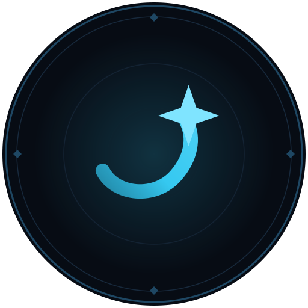

# Quantum Wake

**A pilot's logbook for Star Citizen** — by nekron


Star Citizen writes everything you do to `Game.log` and then rotates it away.
Quantum Wake reads it — the live file and every backup — and gives you back the
flight it recorded: where you have been, what you flew, what you hauled and what
it cost you. A second-screen dashboard, a transparent in-game overlay, and a map
of the whole 'verse with your own trail across it.

It is read-only, entirely offline, and never touches the game.

```powershell
.\start.ps1
```

Dashboard on <http://127.0.0.1:31337>. `Ctrl+Alt+O` toggles overlay
click-through. Your install is found automatically across every fixed drive.

---

## What it shows

| View | Contents |
|---|---|
| **Now** | Where you are with a confidence level, active ship, session clock, quantum destination in flight, live event feed |
| **Map** | Every place in the game across Stanton, Pyro and Nyx — visited ones solid, the rest hollow — with zoom, pan and a live marker |
| **Sessions** | Every session you have played, in-game time separated from menu time |
| **Fleet** | Ships owned over time, flights per ship, estimated time aboard |
| **Places** | Most-visited locations and quantum destinations |
| **Contracts** | Accepted → completed or abandoned, faceted by issuer and type |
| **Spending** | Confirmed purchases by shop, item and category |
| **Ledger** | Every transaction, back-tracked to the place it happened |
| **Cargo** | Commodity trades, the only income the logs record |
| **Loadout** | The kit you are wearing, by slot |
| **Stash** | What is in your inventory and where you left it |

Names are real names — New Babbage, not `Stanton4_NewBabbage`; a Genoa power
plant, not `POWR_JUST_S02_Genoa_SCItem` — read from your own `Data.p4k` at
runtime with no external lookup service involved.

## Why another one

There are a dozen `Game.log` tools, and [docs/landscape.md](docs/landscape.md)
surveys them honestly, including the one that overlaps this heavily. Three
things here are not in the others:

- **The whole map, not just your trail.** Others plot where you went. This draws
  all 1,343 places the game names, so the map shows how much 'verse is left.
- **Offline all the way down.** Every other tool that shows real item names
  fetches them from UEX, the wiki or scunpacked. This reads `Data.p4k` directly
  with its own ZIP64 + ZStd reader, so "no outbound network calls" survives
  contact with the naming problem.
- **It says what the logs cannot support.** Inferred locations carry a
  confidence level, estimates are labelled and capped, and an event CIG removed
  produces an explanation rather than a bare zero.

## Two things it deliberately does not do

**It is not a killboard.** Star Citizen 4.9 does not write kill or
vehicle-destruction events to `Game.log`. This was verified, not assumed: a
line-by-line scan of 403 MB across 144 log backups found **zero** `<Actor Death>`
and `<Vehicle Destruction>` lines, despite 22 incapacitations proving combat
happened. The parser for those events is implemented and tested against the
archived format, sitting dormant — if CIG restores them, the counters populate
with no further work. See [docs/findings.md](docs/findings.md).

**The map is not a radar.** No player position is logged either, so location is
*inferred* from discrete signals — inventory requests, quantum routes, spawns —
and every estimate carries a confidence level rather than pretending to a
precision the logs cannot support.

## Safety

Modelled on SCStats' read-only stance, because this touches a live game install
running Easy Anti-Cheat:

- Reads log files only; nothing is ever written to the game directory
- No memory access, no DLL injection, no DirectX or WinAPI hooking
- No outbound network calls in standalone mode — no CDN, no telemetry
- The overlay is an ordinary top-most window using documented Win32 styles

The trade-off of doing it safely: an always-on-top window is **not** composited
over exclusive fullscreen, so Star Citizen must run in **Borderless Windowed**
for the overlay to be visible. The dashboard has no such limitation.

## Requirements

- Windows 10/11, [.NET 10 SDK](https://dotnet.microsoft.com/download)
- WebView2 runtime (ships with Windows 11) — overlay only

## Usage

```powershell
.\start.ps1                     # dashboard + overlay
.\start.ps1 -NoOverlay          # dashboard only
.\start.ps1 -Lan                # allow a tablet as second screen
.\start.ps1 -Rescan             # force a full re-parse
.\start.ps1 -Path "D:\...\StarCitizen\LIVE"
```

Installs are auto-detected across all fixed drives (LIVE/PTU/EPTU).

The CLI is useful for verification without a UI:

```powershell
dotnet run --project src\Quantumwake.Cli -c Release
```

It prints per-event match counts and a **parser health** section. Because CIG
removes log events patch over patch, an unmatched line is always skipped rather
than fatal — and the health report names the tag and shows a sample so breakage
after a patch is visible immediately instead of appearing as silently empty
charts.

## Try it without playing

`Quantumwake.LogSim` builds a fake install whose logs match the real format,
quirks included:

```powershell
dotnet run --project src\Quantumwake.LogSim -c Release -- --backups 12 --combat
.\start.ps1 -Path "$env:TEMP\QuantumwakeFakeInstall\LIVE"
```

`--combat` emits kill and vehicle-destruction events, which is the only way to
see the dormant killboard populate — real 4.9 logs never will. `--live` appends
to `Game.log` in real time so the Now view and overlay update as you watch.

The cache is scoped per install, so a simulated install never blends into your
real totals. Full options in [docs/log-simulator.md](docs/log-simulator.md).

## Architecture

One web UI, hosted three ways — a browser today, WebView2 in the overlay, and
remote clients when server mode lands. Writing it once is why the overlay cost
almost nothing to add.

```
Overlay (WPF + WebView2)   Browser / tablet        Remote clients (later)
            └──────────── HTTP + SSE / SignalR ───────────┘
                                  │
                    Quantumwake.Server (ASP.NET Core)
                                  │
              Quantumwake.Core          Quantumwake.Data
              tail → parse → state      SQLite + location graph
```

| Project | Target | Role |
|---|---|---|
| `Quantumwake.Core` | `net10.0` | Log tailing, parsing, location + session state |
| `Quantumwake.Data` | `net10.0` | SQLite cache, library aggregates |
| `Quantumwake.Server` | `net10.0` | REST + SSE + static UI |
| `Quantumwake.Overlay` | `net10.0-windows` | Transparent WPF shell |
| `Quantumwake.Cli` | `net10.0` | Backfill and verification |
| `Quantumwake.LogSim` | `net10.0` | Fake-install generator for testing without the game |

Only the overlay is Windows-bound, leaving a Linux-hosted server mode open.

```powershell
dotnet test Quantumwake.slnx      # 154 tests
```

Parser fixtures are real log lines, not synthesised ones — which is how three
format quirks were caught that grepping had hidden, including multi-line entries
whose continuations carry their own timestamp (15% of notifications were being
silently dropped).

## Documentation

- [docs/findings.md](docs/findings.md) — the missing-combat-events evidence
- [docs/log-format-reference.md](docs/log-format-reference.md) — verified line formats and quirks
- [docs/architecture.md](docs/architecture.md) — decisions and why
- [docs/phase-1-core.md](docs/phase-1-core.md) — parser build log
- [docs/commodity-names.md](docs/commodity-names.md) — why a cargo sale cannot be named
- [docs/credits.md](docs/credits.md) — every external resource used, and what came from where
- [docs/naming.md](docs/naming.md) — why the project is called Quantum Wake
- [docs/landscape.md](docs/landscape.md) — who else is doing this, and what is still ours

## Licence

Code is [Apache 2.0](LICENSE). Fork it, sell it, close your fork — the only ask
is attribution.

Two things it deliberately does not cover, both spelled out in [NOTICE](NOTICE):

- **The manufacturer artwork is Cloud Imperium's**, used under the Fankit
  Agreement, which does not permit commercial use. No licence this project grants
  can extend to it. Delete `web/assets/manufacturers/` if that matters for your
  fork — the UI falls back to a text badge.
- **The name and logo are not licensed.** Apache §6 grants no trademark rights,
  and none are granted here. Take the code; ship it under your own name.

No game data is contained in this repository. Names are read at runtime from your
own `Data.p4k`.

## Credits

Built by **nekron**, on top of work that was not mine. Full attribution — what
was taken from whom — is in [docs/credits.md](docs/credits.md). The short
version:

- **Community log tooling.** [StarLogs](https://github.com/Ozy311/StarLogs) by
  Ozy311 is owed the most: the archived combat line formats, the
  kill-classification tree and the NPC-name heuristics in this repo are its
  `event_parser.py` logic re-implemented in C#.
  [all-slain](https://github.com/DimmaDont/all-slain) (DimmaDont) supplied the
  per-patch record of which events CIG removed and when;
  [SCStats](https://github.com/Maple33-hash/SCStats) (Maple33) the read-only
  posture and the purchase-correlation idea;
  [SCPlay](https://github.com/ckuma/scplay) (ckuma) timestamp-span playtime.
  [AutoTrackR2](https://github.com/BubbaGumpShrump/AutoTrackR2),
  [SC-Kill-Monitor](https://github.com/greluc/SC-Kill-Monitor) and
  [citizenmon](https://github.com/danieldeschain/citizenmon) were studied too.
- **`Data.p4k` format.** The ZIP64-with-ZStd-method-100 structure is community
  knowledge from the [scdatatools](https://github.com/ventorvar/scdatatools)
  lineage. The reader here is our own and ships no extractor, but the format was
  not worked out here.
- **Artwork.** Manufacturer marks and the *Made by the Community* badge are from
  the official [Star Citizen Fankit](https://robertsspaceindustries.com/fankit),
  used under the Fankit Agreement.
- **Packages.** [ZstdSharp.Port](https://github.com/oleg-st/ZstdSharp) (Oleg
  Stepanischev), Microsoft.Data.Sqlite, WebView2, xUnit and coverlet. Nothing on
  the client side — no framework, no bundler, no CDN.

Star Citizen®, Roberts Space Industries® and Cloud Imperium® are registered
trademarks of Cloud Imperium Rights LLC. This is an unofficial fan tool, not
affiliated with or endorsed by Cloud Imperium Games.
