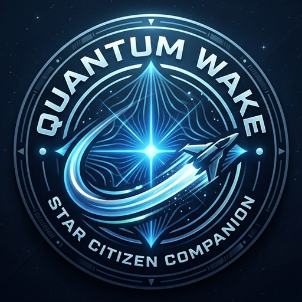
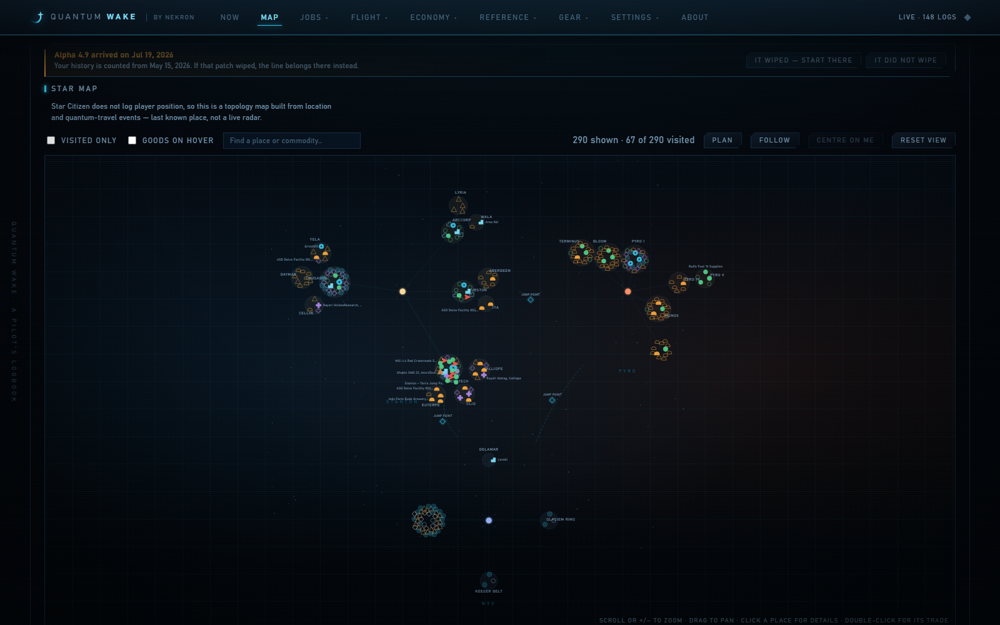
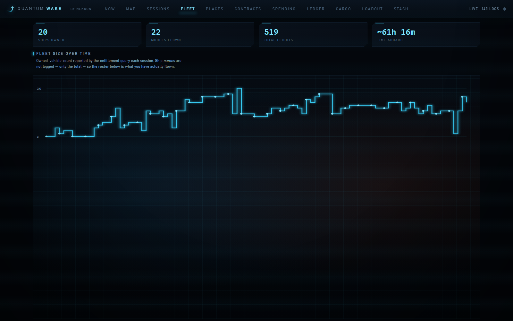
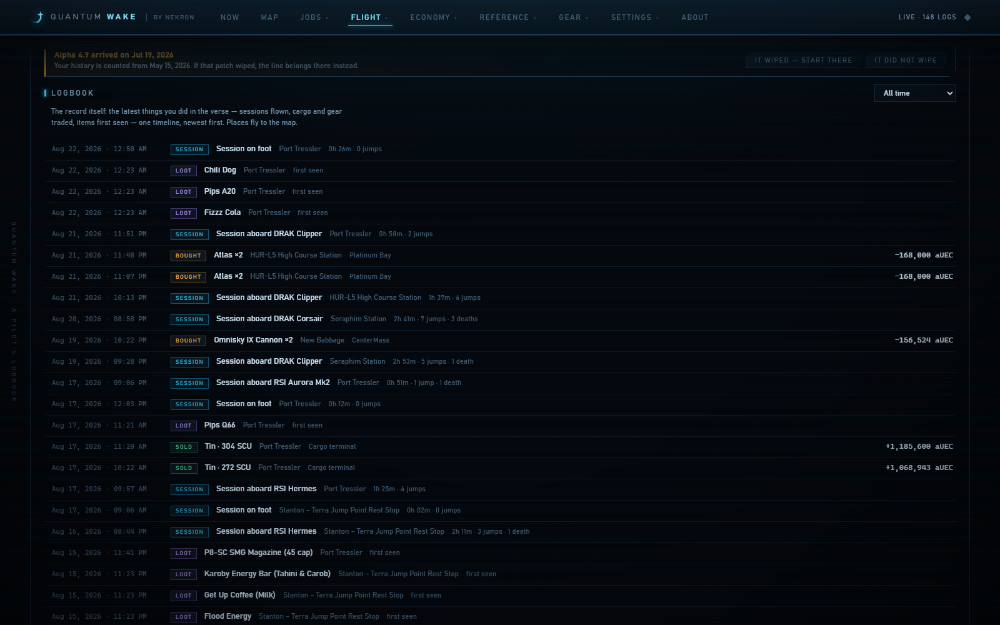
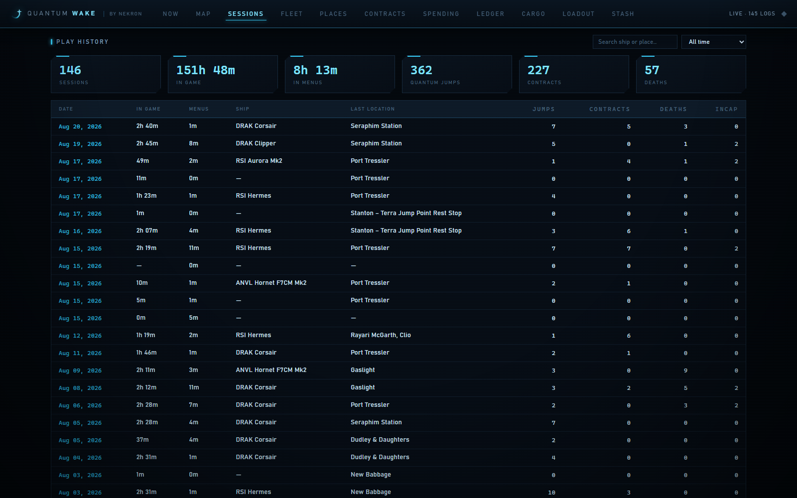
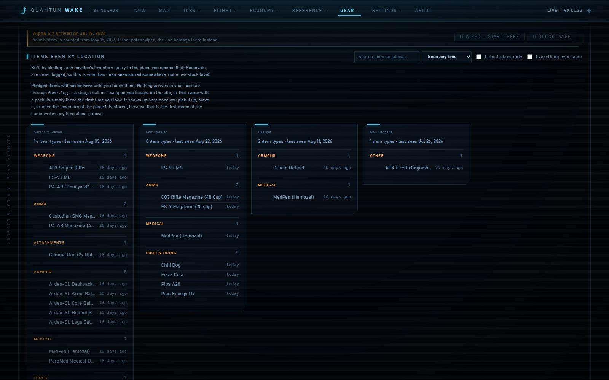
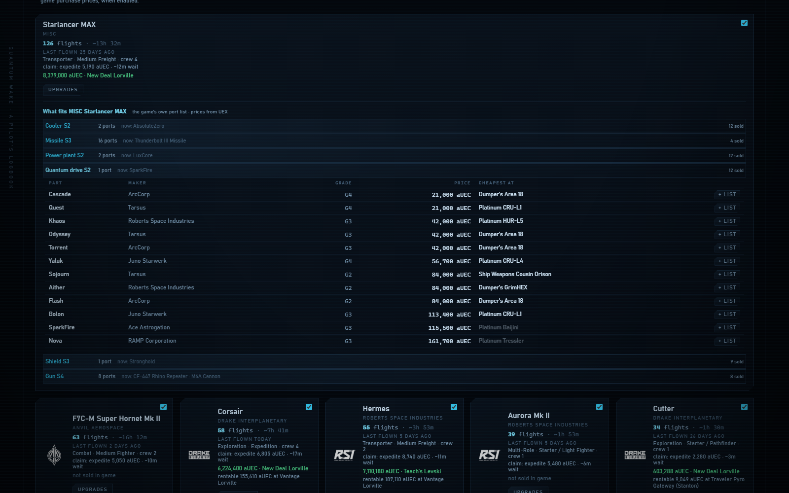
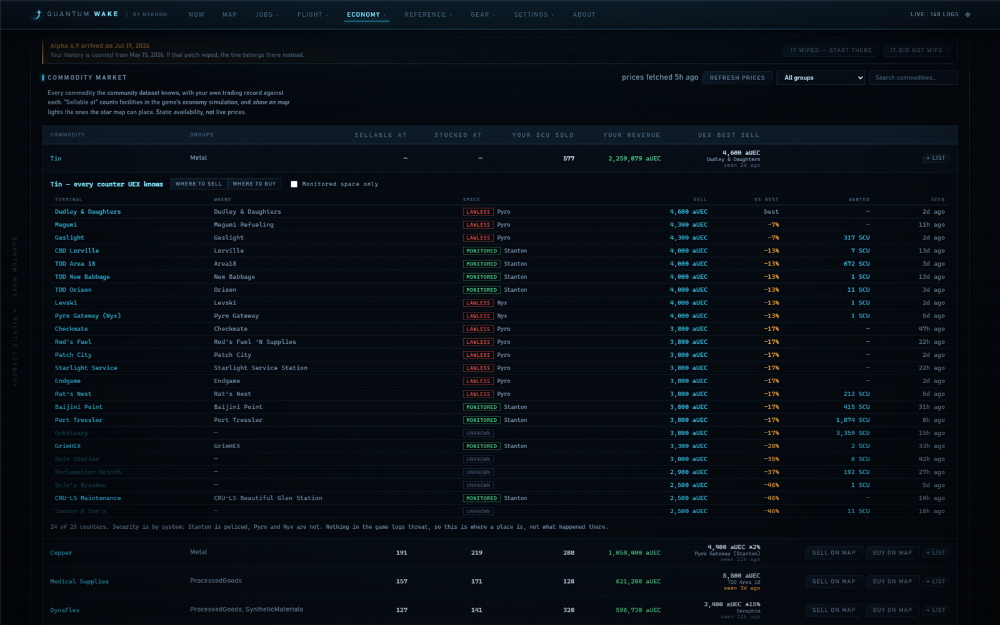

# Quantum Wake

**A pilot's logbook for Star Citizen** — by nekron

[](https://github.com/peans99/QuantumWake/actions/workflows/ci.yml)


Star Citizen writes what you do to `Game.log`, then rotates it away. Quantum
Wake reads the live file and every backup, and shows you the flight it recorded:
where you went, what you flew, what you hauled, what it cost. There is a
dashboard, an in-game overlay, and a map of the 'verse with your own trail on it.

It reads. It never writes to the game folder, with one exception you turn on
yourself: the Item labels page, which can replace the game's English text file
to put marks in item names.

> **Pre-1.0.** Things will keep moving. Pages appear and change, data formats
> shift, and an update may re-read your logs. Nothing is at risk, since it is all
> rebuilt from the logs, but expect changes.

## Getting it

**[Download `QuantumWake.exe`](https://github.com/peans99/QuantumWake/releases/latest)
and double-click it.** One file. No runtime to install, nothing to unpack. It
finds your Star Citizen install on any fixed drive.

It then sits in the notification area. Right-click to open the dashboard, show
the overlay, check for a new version, or quit. The dashboard is at
<http://127.0.0.1:31337>.

Windows will say the publisher is unknown, because the binary is not code
signed. **More info → Run anyway**.

The overlay is off until you switch it on. Its **📌 pin** button gets it out of
the way so clicks reach the game; the tray icon or `Ctrl+Alt+O` brings it back.
Star Citizen has to run in **Borderless Windowed** for the overlay to show,
because an always-on-top window is not drawn over exclusive fullscreen. The
dashboard has no such limit.

From source:

```powershell
.\start.ps1
```



*Stanton, Pyro and Nyx. Solid nodes are places this install has been, 67 of the
290 the resolver can place, sized by how often. The game logs no player
position, so this is built from location and quantum-travel events. It is not a
radar.*

---

## What it shows

| View | Contents |
|---|---|
| **Now** | Where you are, active ship, session clock, live event feed, and what your trading makes per in-game hour. Cards can be hidden, collapsed or dragged, and the arrangement sticks |
| **Map** | Every place across Stanton, Pyro and Nyx. Visited ones solid, the rest hollow. Zoom, pan, follow-me, per-place cards, and a commodity search that lights up everywhere a good sells |
| **Flight plan** | The next stop and the rest of the run, on the Now page and over the map. Built from a trade route, a shopping list, or by hand. Stops cross themselves off as you land |
| **Shopping** | Lists covering cargo and ship parts, checked against your stashes. Read as a set of landings, ranked by how much one stop covers |
| **Sessions** | Every session played, with in-game time kept separate from menu time |
| **Fleet** | Ships owned over time, flights per ship, time aboard. **Upgrades** shows what fits each port, what it costs, and who stocks it |
| **Places** | Most-visited locations and quantum destinations |
| **Contracts** | Accepted, then completed or abandoned, by issuer and type |
| **Crew** | The people you fly with. A floor, not a roster: someone already online when you grouped up produces no log line at all |
| **Spending** | Confirmed purchases by shop, item and category |
| **Ledger** | Every transaction, traced back to where it happened |
| **Cargo** | Commodity trades. The only income the logs record |
| **Market** | Every commodity with your own trades against it, and where each one sells. Click one for every counter that trades it |
| **Mining** | What spawns where, ranked by what a SCU of the rock is worth. Ore share, quality, respawn, and the ore you have sold but never bought |
| **Crafting** | Every recipe: what it makes, how long it takes, what it needs, and where the blueprint drops |
| **Loot** | When each item first showed up in your inventories, and where |
| **Loadout** | The kit you are wearing, arranged around a character frame |
| **Stash** | What you are carrying, and where you left the rest |
| **Item labels** | Writes marks into the game's item names: size, grade, armour class, and a star for anything nothing is known to sell |
| **Settings** | The overlay, UEX, the community dataset, the log cache |

Tables sort by their headers.

<table>
  <tr>
    <td width="50%"><a href="docs/images/fleet.png"></a><br><sub><b>Fleet</b> — ships owned over time, from the entitlement query the game runs each session</sub></td>
    <td width="50%"><a href="docs/images/ledger.png"></a><br><sub><b>Ledger</b> — every confirmed transaction, traced to where it happened</sub></td>
  </tr>
  <tr>
    <td width="50%"><a href="docs/images/sessions.png"></a><br><sub><b>Sessions</b> — in-game time kept separate from menu time</sub></td>
    <td width="50%"><a href="docs/images/stash.png"></a><br><sub><b>Stash</b> — what you carry, and where the rest is</sub></td>
  </tr>
  <tr>
    <td width="50%"><a href="docs/images/upgrades.png"></a><br><sub><b>Upgrades</b> — what fits a ship, priced, with the counter that stocks it</sub></td>
    <td width="50%"><a href="docs/images/market.png"></a><br><sub><b>Market</b> — every counter that trades a commodity, and what it pays</sub></td>
  </tr>
</table>

## Where the data comes from

Almost all of it is read from your own install at startup. Names, the item
catalogue, commodity names, crafting recipes, deposit tables and place
descriptions all come out of `Data.p4k`, with no lookup service involved. It
takes about half a minute the first time after a patch, then caches.

Two optional integrations add what the install cannot answer, and both are off
until you turn them on:

- **UEX** for live crowd-sourced prices. Nothing in the game files says what a
  shop currently charges.
- **The community dataset** (StarCitizenWiki/scunpacked-data) for ship
  specifications and a fuller table of what spawns where. Ship cargo, speeds and
  shield totals are in your install too, but in files the game encrypts.

## What it will not do

**It is not a killboard.** Star Citizen 4.9 and 4.10 write no kill or
vehicle-destruction events. That was checked, not assumed: a line-by-line scan
of 403 MB across 144 backups found zero `<Actor Death>` and zero
`<Vehicle Destruction>` lines, with 22 incapacitations proving combat happened.
The parser for them is written and tested against the archived format, sitting
idle. If CIG restore the lines, the counters fill. See
[docs/findings.md](docs/findings.md).

**It is not a radar.** No player position is logged. Location is inferred from
inventory requests, quantum routes and spawns, and every guess carries a
confidence level.

**It does not track mining.** The game writes down no extraction, no scan and no
refinery job. The Mining page plans; it cannot report what you dug up. Ore you
sold and never bought is as close as the logs get, and the page says so.

## Totals describe the account you are playing

A wipe ends one account and starts another, so totals that reach past one are
answering about an account you no longer have. Older sessions are kept and still
parsed. They are simply not counted, and Settings says how many.

Wipes come at different depths, so you say what this one took: money, ships,
inventory, play history. Tick only what it reset and the rest keeps its history.
The date defaults to Alpha 4.8 on 15 May 2026 and is yours to move or switch off.

## Safety

This touches a live game install running Easy Anti-Cheat, so:

- Log files are read. Nothing is written to the game folder unless you install
  labels or StarStrings from the Item labels page. Both replace one text file
  and can be undone from the same page
- No memory access, no DLL injection, no DirectX or WinAPI hooking
- No telemetry and no CDN. The app goes online only where you have said it may.
  The two things that can go out unattended, the version check and the price
  refresh, are off until you turn them on
- The overlay is an ordinary top-most window using documented Win32 styles

## Reporting a problem

If a page is empty here and full for someone else, **Settings → Report a
problem** saves a small file explaining why: what the parser could not read, the
counts behind each page, your game builds, and which integrations are on. About
a kilobyte. Read it, then attach it to an issue.

**Your logs stay on your machine.** A gameplay log here is 8 MB and 29,000
lines, and it names the pilots you flew with. The report contains none of it. It
is built from a list of things the app chose to include, rather than from a log
with the private parts removed, so there is no pattern to miss: no handle, no
character or account id, no folder names, no UEX keys.

## Requirements

**To run:** Windows 10 or 11. Nothing else. The overlay also wants the WebView2
runtime, which ships with Windows 11. On Windows 10 the dashboard works either
way and the overlay stays blank until
[the runtime](https://developer.microsoft.com/microsoft-edge/webview2/) is
installed.

**To build:** the [.NET 10 SDK](https://dotnet.microsoft.com/download).

## Usage

```powershell
.\start.ps1                     # tray icon, dashboard, overlay
.\start.ps1 -NoOverlay          # the bare server
.\start.ps1 -Lan                # allow a tablet as a second screen
.\start.ps1 -Rescan             # force a full re-parse
.\start.ps1 -Path "D:\...\StarCitizen\LIVE"
```

Installs are found automatically across fixed drives (LIVE/PTU/EPTU).

The CLI checks the parser without a UI:

```powershell
dotnet run --project src\Quantumwake.Cli -c Release
```

It prints per-event counts and a parser health section. CIG remove log events
between patches, so an unmatched line is skipped rather than fatal. The health
report names the tag and shows a sample, so breakage shows up immediately
instead of as an empty chart.

It will also hand you the parsed events, if you would rather use the parser than
the app:

```powershell
dotnet run --project src\Quantumwake.Cli -c Release -- --events
dotnet run --project src\Quantumwake.Cli -c Release -- --events --kind commodity.sell,commodity.buy
```

One JSON object per line, each carrying its own fields, with progress and the
summary on stderr so stdout is nothing but events. 67,267 of them from this
install, across 46 kinds. Pipe it wherever you like.

## Try it without playing

`Quantumwake.LogSim` builds a fake install whose logs match the real format:

```powershell
dotnet run --project src\Quantumwake.LogSim -c Release -- --backups 12 --combat
.\start.ps1 -Path "$env:TEMP\QuantumwakeFakeInstall\LIVE"
```

`--combat` emits kill and vehicle-destruction events, which is the only way to
see the idle killboard fill, since real logs never will. `--live` appends to
`Game.log` as you watch.

The cache is per install, so a simulated one never mixes into your real totals.
Options in [docs/log-simulator.md](docs/log-simulator.md).

## Architecture

One web UI, hosted three ways: a browser, WebView2 in the overlay, and remote
clients later. Writing it once is why the overlay was cheap to add.

It is also one process. `QuantumWake.exe` runs the web server inside itself and
carries the dashboard as embedded resources, which is what lets it ship as a
single file. The server is still its own project and executable, for headless
use and for a Linux-hosted server mode later.

```
        QuantumWake.exe  (one process, one file)
   ┌──────────────────────────────────────────┐
   │  tray icon      overlay (WPF+WebView2)   │      Browser / tablet
   │            ASP.NET Core, in-process ─────┼───── HTTP + SSE / SignalR
   └──────────────────────┬───────────────────┘      Remote clients (later)
                          │
        Quantumwake.Core        Quantumwake.Data
        tail → parse → state    SQLite + location graph
```

| Project | Target | Role |
|---|---|---|
| `Quantumwake.Core` | `net10.0` | Log tailing, parsing, game-data readers, session state |
| `Quantumwake.Data` | `net10.0` | SQLite cache, library aggregates |
| `Quantumwake.Server` | `net10.0` | REST + SSE + static UI |
| `Quantumwake.Overlay` | `net10.0-windows` | Tray icon, transparent overlay, server hosted in-process |
| `Quantumwake.Cli` | `net10.0` | Backfill and verification |
| `Quantumwake.LogSim` | `net10.0` | Fake-install generator |

Only the overlay is Windows-bound, which leaves a Linux server mode open.

## Tests

```powershell
dotnet test Quantumwake.slnx -c Release
```

Two suites. `Quantumwake.Tests` covers the parser, session builder, resolvers,
game-data readers and stores, against fixtures copied from real log lines.
`Quantumwake.WebTests` runs `web/app.js` under a JavaScript engine with a stub
document, so the dashboard's own logic is tested rather than eyeballed.

Fixtures are real log lines, not invented ones. That is how three format quirks
were caught that grepping had hidden, including multi-line entries whose
continuations carry their own timestamp. 15% of notifications were being dropped.

## Documentation

- [docs/findings.md](docs/findings.md) — the missing-combat-events evidence
- [docs/log-format-reference.md](docs/log-format-reference.md) — verified line formats and quirks
- [docs/datacore.md](docs/datacore.md) — how the game's own data files were read
- [docs/architecture.md](docs/architecture.md) — decisions and why
- [docs/commodity-names.md](docs/commodity-names.md) — why a cargo sale is hard to name
- [docs/credits.md](docs/credits.md) — every external resource used
- [docs/naming.md](docs/naming.md) — why it is called Quantum Wake
- [docs/releasing.md](docs/releasing.md) — how a release is cut
- [docs/bug-reports.md](docs/bug-reports.md) — what the problem report holds
- [docs/landscape.md](docs/landscape.md) — who else is doing this

## Licence

Code is [Apache 2.0](LICENSE). Fork it, sell it, close your fork. The only ask
is attribution.

Two things it does not cover, both in [NOTICE](NOTICE):

- **The manufacturer artwork is Cloud Imperium's**, used under the Fankit
  Agreement, which does not allow commercial use. Delete
  `web/assets/manufacturers/` if that matters for your fork; the UI falls back
  to a text badge.
- **The name and logo are not licensed.** Apache §6 grants no trademark rights,
  and none are granted here.

No game data is in this repository. Names are read at runtime from your own
`Data.p4k`.

## Credits

Built by **nekron**, on top of work that was not mine. Full attribution is in
[docs/credits.md](docs/credits.md). The short version:

- **Community log tooling.** [StarLogs](https://github.com/Ozy311/StarLogs) by
  Ozy311 is owed the most: the archived combat line formats, the
  kill-classification tree and the NPC-name heuristics here are its
  `event_parser.py` logic re-implemented in C#.
  [all-slain](https://github.com/DimmaDont/all-slain) (DimmaDont) supplied the
  per-patch record of which events CIG removed and when.
  [SCStats](https://github.com/Maple33-hash/SCStats) (Maple33) the read-only
  posture and the purchase-correlation idea.
  [SCPlay](https://github.com/ckuma/scplay) (ckuma) timestamp-span playtime.
  [AutoTrackR2](https://github.com/BubbaGumpShrump/AutoTrackR2),
  [SC-Kill-Monitor](https://github.com/greluc/SC-Kill-Monitor) and
  [citizenmon](https://github.com/danieldeschain/citizenmon) were studied too.
- **`Data.p4k` and DataCore formats.** The ZIP64-with-ZStd-method-100 archive
  and the DataForge blob structure are community knowledge, from the
  [scdatatools](https://github.com/ventorvar/scdatatools) lineage and
  [unp4k](https://github.com/dolkensp/unp4k)'s `unforge`. The readers here are
  our own and ship no extractor, but the formats were not worked out here. This
  is what lets the app read your install instead of downloading a copy of it.
- **StarStrings** by MrKraken, the in-game text mod the Item labels page can
  install alongside its own marks. Not written by or affiliated with this app.
- **Artwork.** Manufacturer marks and the *Made by the Community* badge are from
  the official [Star Citizen Fankit](https://robertsspaceindustries.com/fankit).
- **Packages.** [ZstdSharp.Port](https://github.com/oleg-st/ZstdSharp) (Oleg
  Stepanischev), Microsoft.Data.Sqlite, WebView2, xUnit and coverlet. Nothing on
  the client side: no framework, no bundler, no CDN.

Star Citizen®, Roberts Space Industries® and Cloud Imperium® are registered
trademarks of Cloud Imperium Rights LLC. This is an unofficial fan tool, not
affiliated with or endorsed by Cloud Imperium Games.

---

## Release notes

Newest first. Each version's section is what the GitHub release says too — the
release workflow lifts it from here, so it is written once.

### 0.9.13

- The app no longer talks as though 4.9 were the current patch. Alpha 4.10
  arrived on 26 Aug 2026, and the things Quantum Wake says it cannot see —
  kills, deaths, who boarded which ship — were all pinned to 4.9 by name, so
  they read as though they might since have been fixed. They have not: across
  the five 4.10 sessions here there is still no death or vehicle-destruction
  line and still no seat-entry event, so the wording now names both patches
  and the check is written down with its numbers.

- The game names its own commodities, and Quantum Wake now reads them. The
  text table carries 307 commodity names under a prefix the reader walked
  past, along with the descriptions the game shows for them — 174 of the 203
  commodities the community dataset knows about now have the game’s own blurb
  available.

- A Text overlay page, and a mark for gear you cannot just buy. StarStrings
  has moved off Settings onto a page of its own, alongside a new overlay that
  puts a `*` after any weapon, armour, attachment, medical item or tool that
  nothing is known to sell — so something worth carrying is obvious while you
  are standing over it. It is layered over StarStrings when that is installed,
  so both survive, and the page shows exactly what would change before
  anything is written.

- Loot prices now read your own receipts. The game records what it charged you
  at a kiosk, so an item UEX has never heard of can still show a price — and,
  more usefully, still counts as something you can buy.

- Cargo is named from your own game install. A sale logs a commodity as an id,
  and resolving it has needed an opt-in 110 MB community download. The install
  already answers it: the id is a record in the game’s own data, which carries
  the name the game displays. Reading it takes about six seconds once per
  patch and caches to 18 KB. All 203 commodities the download knows are named,
  185 of them word for word, and the game knows 342.

- Loot, stash and fleet prices no longer need the download either. Every one of
  the dump's 10,843 item ids turns out to be an id the install already carries,
  so the prices UEX quotes can be looked up without it.

- The Market page works without the download too. Every commodity comes from
  the install and, where each one changes hands, from the counters UEX has an
  observed price at. That is a different question from the one the download
  answers — it describes the economy simulation, including facilities nobody
  has ever priced — so it is a shorter list, and the page says which of the two
  it is showing rather than letting the shorter one pass for the longer. The
  download still adds the unpriced facilities, the commodity groupings and the
  map placement.

- The parts and gear reference comes from your install now. Every item the game
  can attach to anything carries its own definition — type, sub-type, size,
  grade and maker — so the page no longer needs the download for any of it.
  Checked against the download rather than assumed: all 10,843 of its items are
  in the install by class name, and type, sub-type, size and grade agree on
  every single one. The install describes 26,028, so the download was the
  smaller catalogue, and 25,362 items come through with the name the game shows
  rather than a class name. Makers arrive spelled out — Shubin Interstellar
  rather than SHIN — across 119 of them. Reading it costs about 25 seconds once
  per patch and caches.

- What the download is still for, now that it is much less. Ship
  specifications, the ports a ship can fit, place lore and map positions, mining
  spawns and crafting recipes. Ship cargo, speeds and shield totals turned out
  to be in the install as well — the game names each ship's own definition file
  and all 171 are in the archive — but those files are encrypted where the ones
  this app reads are not, so they are closed rather than merely unparsed. The
  download is the honest source for them, and Settings now says so instead of
  implying the work simply had not been done.

- Crafting recipes come from your install too. All 1,606 of them, with the
  first-tier craft time, the materials and which reward pools can drop the
  blueprint. Checked against the download: of the 1,577 recipes both describe,
  the craft time agrees on 1,575 and the materials are worded identically, and
  the same 732 blueprints have a reward pool in each. The handful that differ
  are the interesting part. Three — the Aztalan legs — are recipes offering a
  choice of materials, which the download flattened into three mandatory ones
  and this now reads as "any 2 of". The other two, BroadSpec and the Main
  Powerplant, simply changed in 4.10, so the install is right and the download
  is describing an older patch.

- Mining spawns work without the download, but not as well as with it. The
  install's own deposit tables read cleanly — 1,321 rows across 50 places, with
  the ore each rock actually yields rather than the rock, the deposit name, and
  each entry's real share of its spawn group. The cave tables are in there too,
  and land within two rows of the download's own count of them: 93 against 95,
  naming Aphorite and Hadanite where the raw record says
  MinableElement_FPS_Aphorite. The download still describes more overall — 2,642
  rows across 234 places — so the install fills the page for anyone without the
  download rather than replacing it for anyone who has one, and the page says
  which it is showing. Systems are named only where the game plainly names one:
  Stanton1a is Stanton, while the Aaron Halo is left blank rather than being
  assigned to whichever system it looks closest to.

- Component grades read as A, B, C and D, which is what the game calls them.
  The Upgrades panel showed `G3`, which is neither the game's scale nor obviously
  a grade at all: beside `S2` it reads like a second size, and it gives no clue
  that lower is better. The files store an ordinal, so every page that showed one
  was asking you to know a mapping nobody published. The Parts, Crafting,
  Upgrades and Loadout pages all use the letter now, and the column says A is
  best. A handful of items carry an ordinal past 4, outside anything the game
  shows, and those keep their number rather than being given a letter that would
  mean nothing.

- StarStrings and your item labels can both be installed, in either order. They
  replace the same file, so whichever went in second used to remove the first.
  Installing StarStrings now rebuilds the labels on top of its text, and the page
  says it did. This is what was quietly costing you the contract reputation tags:
  the app read those off StarStrings' own annotation on a contract title, and
  there is nowhere else to read them from.

- The app can now tell that its file was replaced. It only checked that the path
  still existed, which is true whichever mod wrote there last, so it would go on
  reporting labels that had been overwritten. It now records what it wrote and
  checks that too. An install from an older build carries no such record and is
  taken at its word rather than declared missing.

- The Gloss page is called **Item labels**, which is what it does. Same marks,
  same options, clearer name.

- The CLI will hand you the parsed events. `--events` prints one JSON object per
  line, each with its own fields, and `--kind` narrows it to the kinds you want.
  Progress and the summary go to stderr, so stdout is nothing but events and it
  pipes anywhere. 67,267 events across 46 kinds from this install. If you want
  the parser rather than the app, that is the door.

- [docs/datacore.md](docs/datacore.md) came across with the reader it describes:
  how the game's own data format was worked out, wrong turns included, since
  those are the expensive part.

- The readme is shorter and plainer, and the composite screenshot at the top is
  gone. It also describes the app as it is now rather than as it was several
  releases ago: almost everything is read from your own install, and the two
  optional downloads are there for the two things the install cannot answer.

- The Mining page ranks rocks by what they are worth, not by what the ore sells
  for. A high price on an ore that is 2% of the rock is not a good rock, which
  is what the old sort said. *Worth* is the middle of the ore range times the
  best price anything pays, so it answers which rock to shoot; *Find* replaces
  the two odds columns with the one question they were asking together — how
  much of everything spawning here is this.

  There is deliberately no per-hour ranking. Nothing in the logs says how long a
  rock takes to mine, so there is no rate to divide by. Respawn is how long it
  takes to come back, which is a different question and keeps its own column.

  The scale was checked against something the sum never used: your own Tin
  receipts work out at 3,932 aUEC per SCU, inside the 2,500–4,500 UEX quotes for
  it. So the prices really are per SCU, and Janalite really is worth hundreds of
  times ore by volume.

- The Mining page also shows what you have probably mined: 716 SCU of Tin and
  288 of Copper, sold and never bought, worth 3,873,510 aUEC. That is an
  inference, not a record, and it says so — the game writes down no mining at
  all. No extraction, no scan, no refinery job. Ore bought somewhere these logs
  never saw would look exactly the same.

- The Now page says what trading makes you per hour, and how far that leaves
  what you are saving for. On this install that is 70,942 aUEC an hour over the
  last 30 days — 3,955,770 earned across 2 days 8 hours actually in the game —
  which puts a Drake Corsair 47 hours of trading away.

  Two things it is careful about. It is a **trading** rate, not a credits rate:
  commodity sales are the only income the logs record, so no contract payout,
  bounty or mission reward is in it. For a hauler that is close to the whole
  picture and for a contractor it is a fraction of one, so it is labelled as a
  floor wherever it appears. And the hours are in-game hours, with menu time
  left out — counting that would quietly halve the rate of anyone who leaves the
  game open.

  There is no progress bar, on purpose. The logs never state your balance, so
  how far along you are is not something this can know; only how much trading
  the whole thing is worth. A bar would have drawn a number that looks like
  progress and is not.

- **Item labels** has a page of its own, and marks a great deal more than it
  did. The text overlay that marked gear nothing sells now writes everything the
  standalone tool did, in one bracket at the end of the name: `[S2B]` for a size 2 grade B component,
  `[H]` for heavy armour, `*` for nothing known to sell it. On this install that
  is 3,115 names marked as unsold and 2,295 given a size or a class. Four
  characters of content, because the median item name is already 21 and a third
  are over 24.

  Size needs gating rather than printing, which is the whole difficulty: 25,944
  of the 26,028 items carry a size and a grade because 1/1 is the default. Only
  a fitted ship component gets one — a scope is not a part, and saying it was
  the first thing this got wrong. The grade letter was checked rather than
  assumed: the AEGS coolers number 1 to 4 exactly where StarStrings
  independently calls them A to D.

- Optionally, gear nothing sells can be coloured. The game has its own emphasis
  styles and StarStrings already relies on them — `<EM3>` on eight contraband
  commodities, `<EM4>` on 958 contract titles — so this offers the same five
  levels rather than inventing colours. It is off unless you turn it on, and
  that is deliberate: every other mark here can be read back off the disk, but
  whether the game paints an emphasis tag inside an *item name* is only knowable
  by launching the game and looking. Nothing untested gets switched on for you.

- The Mining page now says what quality you can expect, and where that differs.
  Every resource class carries its own distribution and the floor is the part
  worth knowing: ship mining never yields below 501, hand mining never below
  201, and ground mining or gathering can give you anything from 1. This is the
  half that makes 0.9.2 usable — a recipe demanding quality 900 is asking where
  you mined, not only what.

  Some places override the usual, and those rows are marked. Everything in Pyro
  has a wider spread than the same thing elsewhere, meaning more of the very
  good and more of the very poor: common ore moves from 143 to 149, legendary
  from 203 to 225. 165 rows on this install are marked that way.

- Your gear now says how much room it takes. Every item the game defines carries
  a volume, and 9,000 of them carry a real one — a jacket is 8.7 centiSCU, a
  gimbal mount 8.4, a ship cannon a full 120 SCU. It shows when you open an item
  on the Parts page. The other 14,492 say one millionth of an SCU, which is the
  game's way of saying "no volume worth speaking of" for things like ports and
  cargo grids, and those stay quiet rather than claiming to have been measured.

- Deposits also say how long they take to come back, which is not one number:
  most take an hour, some twenty minutes. That is the difference between
  planning a circuit and planning a stop.

- Mining chances were wrong on the install's own tables, and the page said so
  out loud: 2500%. What the game stores per spawn group is a weight, not a
  probability, and its scale is each place's own business — one place's groups
  add up to 0.196 and another's to 90. They are now read as what they are, each
  group's share of what spawns at that place, and the caption says which of the
  two meanings is on screen.

- Place cards say what the game says a place has. Alongside the paragraph, the
  card now lists the services the star map itself records there — Hospital,
  Refinery, Buy Armor, Landing Pad XL, and eighteen more — for the 257 places
  that list any, and names what the place orbits. This is deliberately not the
  same as the service chips above it: those come from UEX and say where you can
  trade today, while this is what the game says is there. The two disagree
  usefully often. Neither has ever been in the community download.

- The Mining page now says how much of a rock is worth having. It has always
  told you how likely a deposit is to turn up and never what is in it; an "In
  rock" column now gives each ore's share of the rock it sits in, read from the
  game. It is a band rather than a figure — ice runs from 9.7 to 84.3 per cent
  depending on the rock — because the game rolls within a range, and one number
  would read as a promise. It needs your install rather than the download,
  which never carried this at all.

- Some recipes will not take just any ore. A handful of crafting materials carry
  a minimum quality, and the Crafting page now says so — "Titanium 2 SCU
  (quality 900+)". It is rare and that is the point: of the roughly 4,300
  material lines in the game, 2,890 ask for quality 0 and 1,377 for 1, which
  both mean anything at all. Only 22 ask for 500 or more, and those are the ones
  where a full hold can turn out to be unusable. Neither this app nor the
  community download has ever mentioned them.

- The game writes a paragraph about most of your gear, and now you can read it.
  9,401 of the 26,028 items the install describes carry the blurb the game shows
  in its own shops — what a mount is for, what a rifle is chambered in. Clicking
  an item on the Parts page opens it, along with the game's own labels for that
  item. One of those labels is worth knowing about: `flightReady` is how the
  game marks what has actually shipped, as opposed to what is merely defined.

- Place descriptions come from your install. Clicking a place on the map opens
  the star map's own paragraph about it, read from the game rather than
  downloaded — 1,344 places against the download's 1,361, and of the 1,294 both
  know, 1,251 are word for word. What is dropped rather than missing: a great
  many map objects carry a "description" that is only their own name again, or a
  line nobody ever filled in, and a card that opens to show the name it was
  already showing is worse than one that says it has nothing.

### 0.8.35

- Ship retrievals are recorded again. Game build 12519617 stopped writing the
  log line that confirmed a retrieved ship had reached the pad, so retrievals
  on the current build went uncounted — the ship shown for a session stayed
  empty and sortie totals stopped rising. Quantum Wake now reads the request
  line the game still writes. Existing sessions are re-read on upgrade, so the
  history fills itself back in.

- The Now page says who is with you. A Party card lists everyone the party
  channel has named this session and the last thing it said about each of
  them, so a member who dropped is not left looking like one still aboard. It
  is a floor rather than a roster, and says so: somebody already online when
  you grouped up is never announced, and the card stays away entirely rather
  than showing a zero it cannot stand behind. It can be switched on in the
  overlay widget too.

- Loot says what things are worth. Each item carries the median price across
  every terminal UEX reports stocking it — what it usually goes for, rather
  than the cheapest run to make. The two are not the same: one item here is
  stocked near 19,175 by a hundred terminals and at 1,975 by one, so the
  cheapest understates it tenfold. Items UEX does not stock show a dash and
  the reason instead of a zero, and the summary says how many of the rows
  carry a price at all.

### 0.8.32

- **Settings can save a report to send with a bug.** If a page is empty for
  you and full for somebody else, this is what says why: what the parser could
  not read, the counts behind each page, your game builds, and which optional
  data is on. It is about a kilobyte, and nothing is sent anywhere — it saves a
  file you read first and attach yourself.
- **Your logs stay on your machine.** A gameplay log is megabytes, most paste
  services refuse it, and it names the pilots you flew with as well as you. The
  report carries none of it: it is built from a list of things the app chose to
  include rather than a log with the private parts taken out, so there is no
  pattern to miss — no handle, no character or account id, no folder names, no
  UEX keys.
- **Example lines are a separate yes.** The fastest way to fix a parser is to
  see the line that beat it, but a line is only in there because the game
  changed its format — and a new format can write your name in a way nothing
  knows to look for yet. So they are off unless you ask, and the page says
  plainly what it cannot promise about them.
- **There is a Discord**, linked from the About page:
  [discord.gg/AV3cDzRs39](https://discord.gg/AV3cDzRs39). Questions, bug
  reports, and a place to say a page looks wrong — which is worth more than it
  sounds, since most of what this app reads was found by somebody noticing a
  number that could not be right.
- Nothing you can see: new releases are announced there automatically,
  [docs/bug-reports.md](docs/bug-reports.md) writes down why a log is the wrong
  thing to send and what a maintainer reads first, and the Loadout screenshot
  is retaken against a current install.

### 0.8.29

- **The first run no longer assumes the newest patch wiped your account.**
  It offered the date of the newest patch in your logs, which meant pressing
  *Start flying* could quietly stop counting months of history — 4.9 and 4.10
  both kept long-term persistence, so neither ended anybody’s account. The
  date offered is now the last wipe there is evidence of, with the newest
  patch named underneath as something to pick rather than something already
  picked. If your history already starts later than it should, move the date
  back in Settings and every session returns — nothing was ever deleted.
- **The wipe you keep is recorded by name**, rather than as “set at first
  run”, which says when the line was decided rather than what it is.
- **The community dataset says which game build it was made from**, and tells
  you when your own logs have moved past it. A patch adds ships, items and
  commodities the downloaded copy has never heard of, and every one of them
  showed as a bare id with nothing to explain why — the block reported a
  count and a download date, neither of which answers whether it is current.
  It now reads *203 commodities · dumped for 4.10.0-LIVE.12519617 · fetched
  Aug 27, 2026*, and says plainly when that build is older than the patch you
  are playing. Nothing goes out to check: both numbers are already on this
  machine.
- **A Refresh button for it**, which there was no way to do short of *Disable
  and delete* followed by *Download*. A refresh replaces the files in place,
  so a failed one leaves the copy you had.
- **A failed download says what failed.** Eleven files are fetched and any of
  them going wrong read as the same sentence with nothing to act on; the
  reason now reaches the page.
- **The dashboard no longer trusts every page in your browser.** Any website
  you visit can quietly send requests to programs on your own machine, and
  until now this one would have acted on them — cleared imports, replaced
  UEX keys, started an update. Requests made on another website’s behalf
  are now refused, including the DNS trick that lets a page read your data
  rather than just poke at it. Nothing changes in how you use the app;
  reading it over the LAN with `-Lan` works as before.
- Nothing you can see: the README now shows the Loadout page, its line in the
  feature table had been describing the list it replaced, and the parser was
  re-checked against 4.10 — every tag still matches.

### 0.8.24

- **Loadout now reads like a character inventory screen.** Your last observed
  equipment is arranged around a central character frame, so head, core, hands,
  weapons, consumables and pack kit read as one outfit rather than a wall of
  unrelated cards. Search still narrows the actual slots, and every card keeps
  the time it was last seen. It remains explicit that this is log evidence, not
  a live game inventory.
- **Check for updates from the tray.** Right-click the Quantum Wake icon
  by the clock and there is a *Check for updates* beside the other
  controls. It answers in a notification: up to date, or the new version
  and what you are on — click that one and the dashboard opens so you can
  read what changed before deciding. Nothing downloads from the tray;
  ninety megabytes is not something to agree to in a balloon.
- **The same check is on the dashboard toolbar**, under Settings, so it no
  longer means opening the Settings page and finding the right block.
- **And it answers wherever you are.** Checking by hand used to write “up to
  date” into the Settings page, which was invisible if you were on any
  other page. The answer now appears at the top of whatever you are
  looking at.
- **A check that fails says so.** If the machine is offline, or the check
  itself goes wrong, that is reported instead of passing in silence.
- **The Now page can be rearranged.** Every card has a grip beside its other
  controls: drag a card where you want it and the page keeps that order.
  The arrow keys move it too, for anyone who would rather not drag. This
  joins the hide (×) and collapse (⌃) controls that were already on each
  card — the arrangement is remembered per browser, alongside those.
- **A card added in a later version arrives beside its neighbours**, not at
  the end and not switched off, so rearranging the page once does not mean
  quietly missing everything added afterwards.
- **The “Hidden cards” row no longer labels an empty space.** It was showing
  on every Now page whether anything was hidden or not.
- **The Loadout simulator tells a useful visual story.** `loadout-swap` now
  equips a full kit across head, core, pack, grenades, medical, utility and a
  stowed weapon before it exercises the repeated undersuit and transient
  hand-weapon cases. It makes an intentional distinction between durable kit
  and what the character happened to hold.
- Nothing you can see: the README's test count said 473 when 798 run, the
  tray's description predated its own new item, and the Now screenshot was
  still showing 0.6.12.

### 0.8.21

- Nothing you can see: notes for whoever works on this next.

### 0.8.20

- **An update keeps the settings it was started with.** Restarting after an
  update dropped any `--data`, `--path` or `-Lan` given on the command line,
  so a copy deliberately pointed at its own folder came back pointed at the
  default one. It now comes back as the same copy it was.

### 0.8.19

- **The update button says what the download costs.** Ninety megabytes is
  worth knowing before agreeing to it rather than after, and on a metered
  connection it is somebody’s actual money.

### 0.8.18

- **Updating is one click.** When a new version is out, Quantum Wake can
  fetch it, check it against the fingerprint GitHub publishes for the file,
  put it in place and restart into it — no browser, no download folder, no
  quitting and swapping files by hand. It also skips the "Windows protected
  your PC" screen, which is a mark browsers put on files they download and
  which an update fetched by the app itself never carries.

  Nothing is replaced unless the download is byte-for-byte what GitHub says
  it published, and if the swap cannot finish the version you were running is
  put straight back. Running from source still updates the old way, and says
  so rather than offering a button that cannot work.

### 0.8.17

- **New items can be narrowed by kind and by place.** Two dropdowns beside the
  search: what kind of thing it is — weapons, armour, ammo, medical and the
  rest, read the same way the Stash page groups them — and where you were when
  it first appeared. Each offers only what your own logs actually contain, and
  an empty table names the filter that emptied it rather than blaming the date
  range.

### 0.8.15

- **Crew now knows who was in the ship, not just who was online.** Every
  vehicle opens a comms channel naming itself *and its owner*, which is the
  only thing in the logs that puts a person inside a particular ship. The
  Crew page lists the ships you and somebody else were both aboard, and
  whether it was theirs or yours. Counted in boardings rather than hours,
  because nothing records how long anyone stayed and a parked ship looks the
  same as a crossing. Your sessions are re-read once after this update.

- **A flight plan is now a run sheet.** Each stop can hold checkable manual
  load, unload, buy, sell, collect, refuel, repair or free-form instructions,
  with an optional quantity and unit. Arriving records the landing but keeps
  that stop active until its run work is crossed off — the log cannot supply a
  cargo manifest, so these are always visibly your own instructions.

- **The map remembers your places.** Save personal POIs directly on an atlas
  place with a title, note and tags. They appear as amber diamonds, can be
  focused with the new Notes filter, and stay clearly separate from services,
  visits and other game-derived map facts.

- **The Now page no longer turns Location into an empty wall.** Compact status
  cards share the first row, while the actionable briefing uses the full width
  below them. Location stays only as tall as its actual information.

- **Build the exact log story you need to test.** The simulator now has named,
  deterministic scenarios for 19 focused cases: single and multi-stop trading,
  tricky purchase confirmation, medical and death recovery, full party
  lifecycle, completed and abandoned contracts, loadout and stash changes,
  fleet and ship retrieval, location correction, disconnects, and archived
  combat. `--scenario all` combines them, while `--list-scenarios` explains the
  focused choices. Every scenario is parsed back through the production reader
  in tests, including a check that no known tag went unmatched.

- **Cargo buys now reproduce the real hundredfold unit trap.** The game writes
  sales as SCU under `amount`, but purchases as centi-SCU under `price`. The
  simulator now preserves that difference so a generated 32 SCU purchase proves
  the production parser returns 32, rather than quietly accepting 3,200.

- **The Crew page had been missing half the party channel.** The game
  announces a party changing under two titles that do not begin with the word
  *Party* &mdash; `New Member Joined` and `Member Left` &mdash; and neither was
  being read. On this install that was 22 joins and 33 departures dropped, and
  **seven people who were never named at all**. Crew now separates the party
  changing from a member’s client coming and going, because somebody who logs
  out and back in has not left, and one number for both makes a friend with a
  poor connection look like one who walked off. Your sessions are re-read once
  after this update to fill them in.

- **Share what your logs know, as a file.** Settings can now save a JSON file
  of your own data for another pilot: what you paid and were paid at a named
  terminal, which blueprints you hold, and the jobs, checklists and flight
  plans you have written. Each is a separate tick and the trade window
  defaults to the last seven days, since a price older than that is a rumour
  rather than a lead. You see the counts before anything is written.

- **What is deliberately not in it.** Market prices from UEX are a third
  party's, crowd-sourced by their datarunners, and are not ours to pass on;
  the crafting catalogue is game data this project has never redistributed.
  A blueprint in a shared file is the name and date the game announced you
  were given it, never a recipe. Your UEX keys are never in it.

- **Open a file somebody sent you, and take it away again.** Shared files get
  their own page under Settings. Each one says whose it is, when the data in
  it was observed rather than merely when it arrived, and what could not be
  read. Nothing is mixed into your own jobs, checklists or history: removing
  an import takes the whole thing away and leaves your work untouched, and
  you can drop one part of a file while keeping the rest, or hide it without
  deleting it.

- **Their rows beside yours, when you ask for it.** One switch shows imported
  jobs, checklists and plans alongside your own, marked with whose they are
  and checked against your stashes &mdash; so "Bob needs four Agricium" reads
  beside "and you have some at Port Tressler". It starts off. Their cards
  carry no buttons that change anything; the one thing you can do is copy a
  list into your own, which makes your copy and leaves theirs alone.

- **Their trades and blueprints stay out of your totals.** Imported receipts
  appear in their own block on Cargo rather than in your earnings, and
  imported blueprints answer "who can craft this" without entering the picker
  that builds a plan you could not carry out.

- **A trade window now means the trades.** Asking for "the last seven days"
  used to be measured against when each play session began, so an evening
  that started just outside the window took every trade made inside it out of
  the answer.

### 0.7.18

- **A clearer overview at the top of this page.** The at-a-glance graphic is
  the same picture in a wider frame, so it fits a screen rather than asking
  you to scroll it. Nothing in the app changed.

### 0.7.17

- **Commodity history now says what is actually missing.** When live UEX
  counters exist but their sampled price history cannot be drawn, the commodity
  page keeps the current counter report and explains that the chart data did
  not load instead of claiming UEX is off.

- **Every session has a debrief.** Select a Play History row to review its
  chronological route, ship and sortie summary, contracts, recorded economy,
  crew-notification floor and latest highlights. Places open on the map, and
  the previous route can become a new flight plan with one click; cargo money
  remains marked as requested rather than confirmed.

- **A map that does not invent geography.** System Positions now shows one
  system at a time with community-starmap bearings and relative orbital
  distances; a body without a matching coordinate is amber and named as such.
  Jump Network is a separate, explicitly not-to-scale diagram of jump links,
  so Nyx and Delamar cannot look like a microTech neighbourhood.
- **Your location is always findable.** The map names the live location in its
  toolbar, keeps it visible through filters, and switches to the correct
  system when selected. Its cyan reticle has an offset callout so it does not
  cover the place label; the jump network marks the current system while
  remaining honest about not knowing an in-system position.
- **A map for the run in front of you.** Focus it on the active plan, shopping
  destinations and known sellers, or recorded stash locations; these layers
  compose with service filters. Body hovers now summarise those signals and
  listed services. Label density can be quiet, automatic or full, controls can
  be saved as a reusable view, and commodity searches show the UEX report age
  without mislabelling visits or services as stale.
- **Cleaner map symbols.** Rest stops and asteroids now have distinct compact
  silhouettes. When a service, work, or commodity focus gives them enough
  room, places carry small shop, refuel, and clinic badges outside their base
  icon, with the map legend explaining the badges.

- **The Market panel stopped being expensive to open.** Its price strip was
  asking UEX about eight counters every time a row was expanded, which is the
  ordinary way to read that table - comparing twenty commodities would have cost
  a volunteer-run API a hundred and sixty requests to draw twenty thumbnails. It
  asks about one counter now, says which counter the line came from, and reuses
  the wider sample when the commodity's own page has already fetched one.

- **Trade routes that admit uncertainty.** The planner now ranks recent,
  capacity-backed reports first, can limit itself to fresh quotes, and shows
  the reported stock, buyer demand, quote age and alternate buyers beside each
  estimated profit. Choose routes with reported capacity, only routes whose
  reports cover the whole target load, or include price-only estimates; the
  evidence column says which case applies. An unrecognised UEX terminal makes
  a clearly-labelled text plan instead of pretending both stops will appear on
  the map. Prices remain community reports, not live inventory or a travel-time
  estimate.

- **A checklist that travels with you.** Make ordinary preparation lists for
  departures and operations, then pin one to Now and, if wanted, the overlay.
  Tick tasks off there or on the new Checklists page. A task can keep a map
  location, commodity or part reference, date, note and HTTPS link attached;
  those are your own reminders, never claims inferred from Game.log.

- **Services lead somewhere.** The map can now filter to UEX-listed shops,
  refuel counters or clinics, with compact icons on the filter, a place card
  and the Now briefing. Clicking a supported service on Now opens that filter;
  repair remains explicitly unlisted because neither installed feed identifies
  repair pads.

- **Now is a launch checklist.** At a live location it joins the active flight
  plan, the next three stops, shopping-list items sold there, local stash,
  available services and up to three buy-here/sell-there trade leads. Its map,
  stop and overlay controls act directly from the card; it never invents a
  cargo manifest the game did not log. Every Now card can also be collapsed,
  hidden, and restored from a compact hidden-cards tray; those choices are
  remembered in the browser. The active ship also carries its local
  manufacturer mark when its maker is known.

- **An accurate overview, at a glance.** The README now leads with a visual
  guide to what Quantum Wake reads, what it can show, the limits of the logs,
  and the optional integrations that add live market data or local reference
  names. It distinguishes `Game.log` from `Data.p4k`, avoids promising a wallet,
  radar, or complete inventory history, and names UEX, StarCitizenWiki's
  scunpacked-data, StarStrings and GitHub rather than integrations the app does
  not use.

- **Read-only over the network.** `-Lan` puts the dashboard on a tablet, and put
  the API there with it - including the endpoints that store UEX keys, write into
  your game folder and move the line your history is counted from, none of which
  ask who is calling. From any machine but this one it is now reads and the live
  feed only; everything else gets a refusal, and the app says so at startup when
  the switch is on.
- **Graphs, on all three places a commodity shows up.** The drill-down gains
  two more: the margin a buy-here-sell-there run would have earned per SCU, day
  by day, and the same weeks drawn counter by counter, because the best-of line
  hides which counter it was and they do not move together - one holding a price
  while the rest slide is the thing worth knowing. Expanding a row on Market now
  carries a sparkline with the range and the span it covers, and a button
  through to the full page. And the Cargo page finally has a shape: what hauling
  has earned you against what it cost, as running totals rather than per-week
  takings, since a hold is sold a few times a month and a weekly line would be
  mostly floor with spikes - a business collapsing between runs rather than one
  being run occasionally.
- **A page that says when the game stopped telling us something.** Star Citizen
  has logged less with every patch - quantum detail went in 4.0.1, inter-system
  jumps in 4.1.0, combat entirely by 4.9 - and from inside this app every one of
  those removals looked exactly like a quiet evening. Settings now lists each
  kind of thing the app reads, how much of it this install has, and *when it
  last arrived*, with anything that has gone quiet for three weeks marked. The
  window is measured against your own last session rather than today, so coming
  back from a month away does not report that everything broke while you were
  gone. Read from the stored sessions rather than from the parser, because a
  scan skips unchanged backups and parser counters would only describe whatever
  happened to be re-read.
- **A commodity, in full.** Market answered "where does this sell" and stopped
  there. Clicking through from a row now opens the good's own page: what it has
  been worth day by day, demand against supply over the same weeks, every
  counter that buys it and every counter that stocks it - each against the best
  price and dated - and your own receipts underneath, from your logs rather than
  anybody's price table. UEX turns out to serve per-counter history, which is
  where the two charts come from. It serves it one counter at a time, though, so
  a good trading at thirty-five of them would be thirty-five requests to draw one
  line: the app asks the busiest few instead, taken from both ends of the trade -
  where a hold empties and where it fills - and says on the page how many of how
  many it sampled. Ranked by volume, never by price, because the best price is
  often a counter wanting nine SCU and a trend drawn from those describes a
  market nobody trades in. Each counter carries its last reported figure forward
  until it reports again, so a day nobody reported reads as quiet rather than as
  a collapse. Fetched on the click that opens the page, never on a page load and
  never while UEX is off, and the page has a link of its own -
  `#commodity/Aluminum`.
- **The people you fly with.** A 4.9 or 4.10 log names another player in exactly one
  place: the toasts announcing that somebody in your party came online or
  dropped. There is no roster event, no join event carrying a member list, and
  no player id anywhere - so that channel is the whole of what can be known,
  and the new *Crew* page is built from it. 27 people on this install, ranked by
  sessions shared rather than by toast count, since a player with a poor
  connection would otherwise outrank everyone who quietly flew a whole night
  with you. The page states plainly that every figure is a floor: a friend
  already online when you grouped up, who stayed until you logged off, produces
  no line at all. Arrivals and drops also reach the live feed as they happen.
  Of 291 party notifications, 273 are read and the remaining 18 name nobody -
  join-queue and matchmaking chatter, left unread rather than guessed at.
- **Prices can keep themselves current.** The price table is the one thing here
  with a shelf life: pulled a fortnight ago it looks exactly like one pulled this
  morning, and every margin on the page is quietly wrong. It can now be given
  standing leave to refetch itself every six hours while the app is open -
  offered during first-flight setup under the UEX option, and switchable any time
  in Settings. It is off unless you turn it on, it does nothing while UEX itself
  is off, and turning it on never enables UEX by the back door. This is the only
  thing in the app that goes out without a click, which is why it is asked for
  rather than assumed, and why the About page now names it. The startup offer to
  refresh a day-old table stays for everyone who leaves this off.
- **What the cargo cost you.** Buying a commodity was never read. The tag was
  routed, but the pattern behind it only fitted a sale, so every purchase fell
  through as an unrecognised line - the last unmatched tag in 418 MB of logs.
  Cargo could be watched leaving and never arriving, and no run could be priced.
  Buying is the same transaction written differently: the total is `price`
  rather than `amount`, there is no `transactionMode`, and the quantity is
  counted in centi-SCU - so a 320 SCU hold reads as 32,000 unless it is
  converted. Both shapes parse now, quantities are SCU on either side, and the
  13 purchases on this install come out at prices per SCU that agree with the
  figure the game printed beside them. *Cargo bought* on the Commodities page
  stops reading zero, and every counter you have bought from says what it
  charged. Sessions you have already got were summarised by a build that dropped
  the buy, so the first launch after this update re-reads your backups once to
  fill them in - slower than usual, and only that once.

- **Charts, filters and the launch card say the right thing.** The key under
  a chart now names the line it is drawn beside rather than the one above it,
  which showed up whenever a line was too short to draw. *Fresh only* no
  longer empties the route table on installs whose price cache predates the
  quote timestamps, and an empty table names the tickbox that emptied it
  instead of blaming your location. A briefing that cannot be fetched hides
  itself and tries again, rather than leaving the last place you were at on
  screen labelled with the one you are at now. Demand and supply on a
  commodity are reported per counter reporting them, so the line follows the
  market rather than the number of volunteers who filed a report that day.
  Checklists stop filing a commodity as a part when the catalogue is still
  loading, and the *Add task* button comes back if the request fails.

### 0.6.17

- **Fixed the stray character in 64 places.** A byte-level repair in 0.6.15
  matched the tail of every valid middot as well as the broken one it was aimed
  at, doubling the lead byte - so separators across the Settings feeds, the
  market and the map read as a replacement glyph. All 64 repaired, every text
  file checked as valid UTF-8.
- **A bed where there is no clinic was a hab bed.** With the UEX place
  directory enabled, a bed used somewhere with no clinic is ruled out of being
  medical - which the directory can do, while the reverse it cannot: Port
  Tressler has habs and a clinic, so a bed there is still either one, and the
  app says so rather than picking. On this install it rules out nothing, since
  every bed was used at a place that has a clinic; it earns its keep for anyone
  who beds down at outposts.
- **Waking up is not a hospital visit.** The game prints the same line for
  every bed - the clinic bed you crawl into and the hab bed you wake up in at
  login - so every login was being counted as a medical bed. They are told
  apart now by what surrounds them: a bed within three minutes of leaving the
  menus, with nothing having happened to you, is waking up. On this install
  that is 27 of them, and Port Tressler drops from 68 bed visits to 54. Beds
  used after a death or an incapacitation are marked as such, since that is the
  one case that is unambiguously medical. The section is called *Beds used*
  now, and the logins are still reported - just not counted as treatment.
- **Standing: who you have worked for.** A table on the Contracts page of every
  issuer, how many contracts you took, how many you finished and the rate, how
  many you walked away from, and the span you have been working for them. This
  install: 16 factions, 205 contracts, 62% finished. Two spellings of one
  faction are one row - the game writes both "Red Wind" and "Redwind", and BHG
  for the Bounty Hunters Guild.
- **What a contract pays, where anyone has written it down.** The game logs a
  contract's displayed title, and that title comes from the file the StarStrings
  mod replaces - so with the mod installed, titles carry `[150 Rep]` and `[BP]`
  and the app reads them straight off. Shown as chips on the contract and summed
  per faction. **This is not your reputation**: nothing in the logs carries a rep
  value, the tags cover a fraction of contracts, and a faction with no annotated
  title shows a blank rather than a zero.
- **StarStrings, installed from Settings if you want it.** A community text mod
  by **MrKraken** that rewrites the game's English text to read more usefully:
  contracts that award blueprints tagged `[BP]`, shorter item names, the
  reputation a contract pays shown on it, and the mining guide sorted by rarity.
  The app fetches their release, checks whether a newer build is out, and can
  take it back out again. It is the only thing here that writes into your game
  folder: two files, anything else in the download refused outright, whatever
  was there copied aside first and put back on removal. Entirely MrKraken's
  work - nothing of theirs is bundled or altered here.

### 0.6.12

The map learns what things are, the app learns what it cannot count, and the
buttons stop looking borrowed.

- **A shopping list can say where it is for.** The new-list form has a
  destination picker - every place the app knows, visited ones first - and a
  second picker for what to add: 203 tradeable commodities and 2,349 parts and
  pieces of gear that can actually be bought. Picking one writes the line into
  the box, where it can be given a quantity like anything else; the box is
  still free text and the pickers only spell things for you.
  The plan then starts every line at that place when it sells the thing, ranks
  it first among the stops, and says so at the top of the chooser. Leave it
  blank for anywhere, which is what it did before. It is a field on the card
  too, because the run you meant on Tuesday is not the run you fly on Friday.
- **The map declutters itself.** At system scale only the busiest places are
  named - thirteen of them, rather than every place you have ever visited
  fighting for the same air - and the budget grows with the square of the zoom,
  so names arrive as you ask for detail. Past the detail threshold every name
  that fits is drawn, as before. A searched-for place is never rationed.
- **A jump in progress is drawn.** When the drive spools, the map runs a
  marching dashed vector from where you are to where you are going, with a
  pulsing ring waiting at the far end. The live feed always knew the
  destination; the map never showed the journey.
- **A body groups its places when you look at it.** Hovering the space a planet
  occupies lights the bubble its outposts and stations sit in, and clicking the
  gaps between them frames that body. At rest the bubble stays a faint ground
  rather than another thing to read.
- **The kill counter is gone.** It could only ever read zero: 4.9 and 4.10 write no
  kill or vehicle-destruction line at all, so a counter pinned at zero read as a
  broken feature rather than a missing one. The About page says where it went
  and what would bring it back.
- **The map was not clickable at all with a real mouse.** It captured the
  pointer the moment you pressed, and a captured pointer delivers the click to
  the element holding the capture - so every click meant for a place went to the
  map instead. Nothing opened: not the card, not the trade panel on a
  double-click, not a stop onto a plan. The capture now waits until you have
  actually moved four pixels, so a press is a click and a drag is still a drag.
  It had been that way since the map was written; it passed its own tests
  because a synthetic click aimed straight at a node bypasses pointer capture,
  which is the one thing a real mouse cannot do.
- **Your position pulses again.** The marker was drawn all along, but the live
  feed repeats your location every second and each repeat rebuilt the marker,
  restarting a 2.2-second animation a fifth of the way in. It is redrawn only
  when you actually move now.
- **A ship part on a list says where to buy it.** The card priced shields and
  coolers but left "where" blank, which is the half you can act on.
- **Upgrades works for every ship, not just some.** The panel asked by display
  name - "Drake Corsair" - while the ship data is keyed by class - DRAK_Corsair.
  Anything whose maker word is not its code (Drake, Anvil, Aegis) or that spells
  a variant differently (Mk II against Mk2) came back empty.
- **Half the map was unclickable.** Every mark carries an invisible pad so a
  small one is easy to hit, and in a crowded cluster those pads covered their
  neighbours — the topmost won every click, so most places would not open their
  card, would not open their trade panel on a double-click, and could not be
  added to a plan. The pad now stops at the halfway line to the nearest
  neighbour. 151 of 290 places were unreachable; now none are.
- **A commodity now colours the whole map.** Pick one and every mark takes the
  price grade or goes slate — a station left cyan among a scale running green to
  gold read as a value on that scale when it was not one.
- **Click a commodity on the Market page** for every counter UEX knows, not just
  the best one: what each pays, what that costs you against the best, how much
  it will actually take or sell you, and whether it sits in policed or lawless
  space — with a filter for monitored space only, and a click to find any of
  them on the map.
- **A shopping list can hold ship parts.** A line is whatever you wrote, so
  "Bulwark" now finds the shield and its shop counters the same way "Agricium"
  finds the trade good, and each seller says which system it is in and whether
  the law reaches it.
- **What fits your ship, and where to buy it.** Every ship on the Fleet page has
  an *Upgrades* button: the game's own port list — quantum drive, shields,
  coolers, power plants, guns, racks — each with what it flies with now, what is
  sold that fits, the maker and grade, the price and the cheapest counter. Any
  of it goes onto a shopping list in one click. This needs the community
  dataset; refresh it on the Settings page if the panel says so.
- **A shopping list, by location.** The chooser has a second view: every counter
  that carries any of your list, ranked by how much of it one landing covers,
  with what that landing costs and whether it is lawless. Tick the stops you
  mean to fly and the plan is built from them — later stops only pick up what
  earlier ones missed, and *Fewest stops* covers the whole list in as few
  landings as it can. Buying each thing where it is cheapest is one landing per
  thing, which is rarely the run you want.
- **The logbook says how many.** A kiosk logs one line per order, so buying
  two of something wrote one line reading the price of both: two orders of two
  read as two purchases of one at twice the price. The count is on the line now.
- **Shops at rest stops are on the map now.** "Platinum CRU-L4" and its like are
  named for the station code alone, which matched nothing in the atlas, so every
  item shop out there was a stop with no dot and no route.

- **The map draws what a place is.** Every kind has its own mark — a skyline for
  a city, a headframe for a mine, an orbit for a research station, a crate for a
  distribution centre — in the same colour it always had, so the legend is a
  reminder rather than something to memorise. And planets are finally on the
  map: they were labels with nothing drawn, which is why a station looked bigger
  than the world it orbits. Each body is a quiet disc with its places on it.
  The marks are single bold silhouettes rather than little drawings: they are
  read at six pixels, where a headframe and an orbit turn to mush. Sizes are
  levelled too — visits still nudge a mark, but gently, because a four-fold
  range made the map read as a jumble of sizes rather than a set of places.

- **A crowded cluster opens up when you zoom in.** microTech piled its sites on
  top of each other however far you zoomed; the cluster now spreads once the
  view is close enough to be naming everything, and stays compact at system
  scale where it should read as one place. Clicks near a cluster work again too
  — an invisible hover disc had been landing on its neighbour's dots.
- **Commodity search answers to part of a name.** "medical" finds Medical
  Supplies; before, only the exact full name matched, and nothing ever showed
  you what that name was. Shortest match wins, a place name still finds the
  place, and the suggestion list offers commodities beside places.

- **The map draws what a place is.** Every kind has its own mark now — a skyline
  for a city, a headframe for a mine, an orbit for a research station, a crate
  for a distribution centre — in the same colour it always had, so the legend is
  a reminder rather than something to memorise. And planets are finally on the
  map: they were labels with nothing drawn, which is why a station looked bigger
  than the world it orbits. Each body is a quiet disc with its places on it.
- **The overlay arrives usable.**
 It used to start click-through: a pane that
  could not be moved, resized or closed, with a hotkey nothing mentioned as the
  only way out. Now it starts ready to grab, and a **📌 pin** button in its header
  puts it out of the way. The tray icon brings it back — a pinned window passes
  every click to the game, so it cannot carry its own way out — and `Ctrl+Alt+O`
  still works.
- **It can tell you a new version is out**, if you let it. You are asked once at
  startup; Settings → *New versions* holds the switch and a Check now button.
  One request to GitHub's public release feed, carrying nothing about you, and
  nothing is downloaded or installed — you get the release page.
- **It notices patches.** Nothing in the logs says an account was wiped, but they
  date every version, so the app brings the date and asks the one question it
  cannot answer: did that patch wipe? Asked once per patch. The first-run wizard
  asks the same thing before anything is counted.
- **A FAQ on the About page**, including why pledged ships and armour are missing
  until you touch them — nothing that arrives in an account is written to the
  log — and where to report anything wrong: **nekhron** on Discord, or the
  GitHub issues page.
- **Medical beds are tracked.** The game does log something about regen after
  all: using a bed says so. A bed at a known place is a more direct hint at
  where you will wake than waiting for the next death, so it is shown beside the
  wake-up inference rather than instead of it — 191 bed visits against 22
  wake-ups here, so most bed use is just healing.
- **Every button looks like the app.** The HUD button style was written inside
  the map's toolbar, so the map had chamfered cyan buttons and the other
  twenty-nine were whatever Windows draws by default. Delete now reads as
  destructive, an on state reads as on, and keyboard focus is visible.
- **The overlay stops flickering on its tab strip.** Hovering the strip made the
  widget's dissolved menu groups spring back into floating boxes, which reflowed
  the strip, slid it left, took the pointer off the group, dropped the hover and
  flipped it straight back — a layout fighting the cursor.
- **An update no longer arrives half-applied.** The dashboard's stylesheet and
  script were served with no caching rule, so the browser guessed how long they
  stayed fresh: the version number came from the app and read new while the page
  around it was the previous release. Only Ctrl+F5 fixed that, which is not
  something anyone should have to know. Both are revalidated on every load now —
  still a 304, still instant, but always the build you are running.
- **This update re-reads your logs once.** A summary parsed by an older build
  knows nothing of fields added since — medical beds would have been invisible
  to everyone already running the app — so the cache retires itself and the
  first start after updating rebuilds it. Two seconds here for 149 backups.
  Nothing is lost: it all comes from the logs.

- **The map prices cargo.** Pick a commodity and every place it trades is graded
  by what it is worth there: the best terminals now, from UEX, beside your own
  receipts over the last day, three days, seven or longer. Selling and buying
  are a toggle rather than a search prefix nothing mentioned, and a third
  shading — *my own prices* — grades the map from your receipts alone, so it
  works with the price feed switched off.
- **Double-click a place** for what it takes and offers: what you have sold
  there, what you have bought, what the catalogue says it stocks, and the
  receipts behind all of it.
- **Flight plans.** A list of places in the order you mean to fly them, on the
  Now page as *jump next* and drawn over the map as numbered stops. Build one by
  hand, from a trade route in one click, or from a shopping list — which now
  asks which seller you meant, marks the ones too small to fill your order, and
  defaults to the cheapest that can. **Stops cross themselves off when you land**,
  because the app already knows where you are.
- **Totals describe the account you are playing.** Sessions from before the last
  wipe are kept and still parsed, but no longer counted. Wipes come at different
  depths, so you say what this one took — money, ships, inventory, play history —
  and anything it did not take keeps its whole history. Defaults to Alpha 4.8 on
  15 May 2026 and lives on the Settings page.
- **Stale prices offer to renew themselves.** The price feed is still fetched
  only on your click, but if the snapshot has turned a day old the app says so
  at startup and offers the one click that fixes it. "Not now" lasts the day.
- **The overlay can show the flight plan**, and a card added in a later version
  no longer arrives switched off for anyone who had touched those settings.
- Under the hood: UEX terminal names are matched to map places once, on the
  server, so the shading, the panel and the plan cannot disagree; and the
  dashboard's own JavaScript has tests for the first time.
